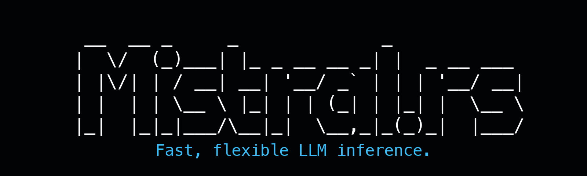

<a name="top"></a>
<!--
<h1 align="center">
  mistral.rs
</h1>
-->

<div align="center">
  <picture>
    <source media="(prefers-color-scheme: dark)" srcset="res/banner-dark.gif">
    <source media="(prefers-color-scheme: light)" srcset="res/banner-light.gif">
    
  </picture>
</div>

<p align="center">
  | <a href="https://ericlbuehler.github.io/mistral.rs/"><b>Documentation</b></a> | <a href="https://ericlbuehler.github.io/mistral.rs/quickstart/"><b>Quickstart</b></a> | <a href="https://crates.io/crates/mistralrs"><b>Rust SDK</b></a> | <a href="https://ericlbuehler.github.io/mistral.rs/guides/python/getting-started/"><b>Python SDK</b></a> | <a href="https://discord.gg/SZrecqK8qw"><b>Discord</b></a> |
</p>

<p align="center">
  <a href="https://github.com/EricLBuehler/mistral.rs/stargazers">
    
  </a>
</p>

## Latest

- **OpenAI-compatible Skills**: upload `/v1/skills` bundles and reference them from Responses requests for reusable procedures, helper scripts, and local data. [Guide](https://ericlbuehler.github.io/mistral.rs/guides/agents/skills/)
- **OpenAI-compatible file inputs**: upload `/v1/files`, attach Responses `input_file` or Chat `file` parts, and mount request files into shell/code sessions. [Guide](https://ericlbuehler.github.io/mistral.rs/guides/agents/file-inputs/)
- **DiffusionGemma**: block-diffusion text generation. Fully integrated: paged attention, prefix caching, ISQ, multimodal, and tool calling. [Guide](https://ericlbuehler.github.io/mistral.rs/guides/models/use-block-diffusion/)
- **Anthropic Messages API**: `mistralrs serve` now exposes Anthropic-compatible `/v1/messages` and `/v1/messages/count_tokens` endpoints alongside the OpenAI-compatible `/v1` API. [Guide](https://ericlbuehler.github.io/mistral.rs/guides/serve/anthropic-messages-api/)
- **v0.8.2 CUDA performance**: CUDA graphs, FlashInfer paged kernels, and MoE optimizations deliver strong results on GB10, B200, and H100 SXM. [Benchmarks](#benchmarks)
- **Agentic runtime**: web search, local Python code execution, shell execution, OpenAI-compatible Skills, session management, and custom tool hooks. [Guide](https://ericlbuehler.github.io/mistral.rs/guides/agents/)
- **Gemma 4**: full multimodal: text, image, video, and audio input. [Supported models](https://ericlbuehler.github.io/mistral.rs/reference/supported-models/) | [Video setup](https://ericlbuehler.github.io/mistral.rs/guides/models/video-setup/)

## Benchmarks

<details>
<summary><b>v0.8.2 CUDA benchmarks</b></summary>

Mean tokens per second across prompt lengths and decode depths from 128 to 16384 tokens. Decode uses 256 generated tokens. See the full [v0.8.2 report](releases/v0.8.2/report.md) for commands, model revisions, host metadata, and appendix tables.

**Q8 prefill TPS: mistral.rs UQFF q8 vs llama.cpp GGUF Q8_0**

| Model | Hardware | mistral.rs | llama.cpp |
|---|---|---:|---:|
| Gemma 4 E4B | GB10 | 7395.7 | 3973.7 |
| Gemma 4 E4B | B200 | 27705.6 | 11992.4 |
| Gemma 4 E4B | H100 SXM | 26220.6 | 11702.1 |
| Gemma 4 26B-A4B | GB10 | 2947.0 | 2178.5 |
| Gemma 4 26B-A4B | B200 | 12725.3 | 8503.4 |
| Gemma 4 26B-A4B | H100 SXM | 12362.3 | 8055.1 |

**Q8 decode TPS: mistral.rs UQFF q8 vs llama.cpp GGUF Q8_0**

| Model | Hardware | mistral.rs | llama.cpp |
|---|---|---:|---:|
| Gemma 4 E4B | GB10 | 44.1 | 40.5 |
| Gemma 4 E4B | B200 | 241.4 | 194.4 |
| Gemma 4 E4B | H100 SXM | 223.1 | 183.0 |
| Gemma 4 26B-A4B | GB10 | 46.8 | 46.4 |
| Gemma 4 26B-A4B | B200 | 210.9 | 192.2 |
| Gemma 4 26B-A4B | H100 SXM | 199.8 | 183.9 |

**BF16 prefill TPS: mistral.rs BF16 vs vLLM BF16**

| Model | Hardware | mistral.rs | vLLM |
|---|---|---:|---:|
| Gemma 4 E4B | GB10 | 5838.9 | 5812.9 |
| Gemma 4 E4B | B200 | 43547.8 | 39431.2 |
| Gemma 4 E4B | H100 SXM | 35852.2 | 39293.7 |
| Gemma 4 26B-A4B | GB10 | 592.2 | 3878.6 |
| Gemma 4 26B-A4B | B200 | 3467.3 | 28532.8 |
| Gemma 4 26B-A4B | H100 SXM | 2766.0 | 26295.9 |

**BF16 decode TPS: mistral.rs BF16 vs vLLM BF16**

| Model | Hardware | mistral.rs | vLLM |
|---|---|---:|---:|
| Gemma 4 E4B | GB10 | 25.1 | 18.8 |
| Gemma 4 E4B | B200 | 202.6 | 196.2 |
| Gemma 4 E4B | H100 SXM | 174.4 | 153.0 |
| Gemma 4 26B-A4B | GB10 | 26.9 | 23.2 |
| Gemma 4 26B-A4B | B200 | 159.6 | 220.2 |
| Gemma 4 26B-A4B | H100 SXM | 138.7 | 148.0 |

</details>

## Why mistral.rs?

- **Any Hugging Face model, zero config**: Just `mistralrs run -m user/model`. Architecture, quantization format, and chat template are auto-detected.
- **True multimodality**: Text, vision, video, and audio, speech generation, image generation, and embeddings in one engine.
- **Smart quantization**: `--quant` automatically selects the best quantization format at that level: using a prebuilt UQFF if one is published, otherwise applying ISQ. [Docs](https://ericlbuehler.github.io/mistral.rs/guides/quantization/quantize-a-model/)
- **OpenAI + Anthropic compatible serving**: The same `mistralrs serve` process exposes OpenAI-compatible `/v1` endpoints and Anthropic-compatible Messages endpoints.
- **Prometheus metrics**: `mistralrs serve` exposes a `/metrics` endpoint in Prometheus format, recording per-request counts and latency labeled by method, route, and status. [Docs](https://ericlbuehler.github.io/mistral.rs/reference/http-api/)
- **Built-in web UI**: Served at `/ui` by default. Shows reasoning, code execution, plots, and files inline. Edit any message and the new branch runs with its own Python state. Pass `--no-ui` to disable.
- **Hardware-aware**: `mistralrs tune` recommends quantization and device mapping from the model config and your detected hardware.
- **Flexible SDKs**: Python package and Rust crate to build your projects.
- **Native agentic support**: built-in [agentic loop](https://ericlbuehler.github.io/mistral.rs/guides/agents/) with web search, local Python code execution, shell execution, OpenAI-compatible Skills, session management, and custom tool hooks.

## Quick Start

### Install

**Linux/macOS:**
```bash
curl --proto '=https' --tlsv1.2 -sSf https://raw.githubusercontent.com/EricLBuehler/mistral.rs/master/install.sh | sh
```

**Windows (PowerShell):**
```powershell
irm https://raw.githubusercontent.com/EricLBuehler/mistral.rs/master/install.ps1 | iex
```

Downloads a self-contained prebuilt binary for your platform (Metal on Apple Silicon; per-GPU CUDA or CPU on Linux; CPU on Windows), falling back to a source build if none matches. No Rust or CUDA toolkit needed for the prebuilt path.

[Manual installation, accelerator details & other platforms](https://ericlbuehler.github.io/mistral.rs/quickstart/)

### Run Your First Model

```bash
# Interactive chat
mistralrs run -m Qwen/Qwen3-4B

# One-shot prompt (no interactive session)
mistralrs run -m Qwen/Qwen3-4B -i "What is the capital of France?"

# One-shot with an image
mistralrs run -m google/gemma-4-E4B-it --image photo.jpg -i "Describe this image"

# Agentic REPL: search + code execution + shell from the terminal
mistralrs run --agent -m Qwen/Qwen3-4B

# Start an API server with the built-in web UI
mistralrs serve -m google/gemma-4-E4B-it
```

For the server command, visit `http://localhost:1234/ui` for the web chat interface. OpenAI-compatible clients use `http://localhost:1234/v1`; Anthropic-compatible clients use `http://localhost:1234`.

### The `mistralrs` CLI

The CLI is designed to be **zero-config**: just point it at a model and go.

- **Auto-detection**: Automatically detects model architecture, quantization format, and chat template
- **All-in-one**: Single binary for chat, server, benchmarks, and web UI (`run`, `serve`, `bench`)
- **Hardware-aware tuning**: `mistralrs tune` recommends quantization and device mapping for your model and hardware
- **Format-agnostic**: Works with Hugging Face models, GGUF files, and [UQFF quantizations](https://ericlbuehler.github.io/mistral.rs/reference/uqff-format/) seamlessly

```bash
# Recommend settings for your hardware and emit a config file
mistralrs tune -m Qwen/Qwen3-4B --emit-config config.toml

# Run using the generated config
mistralrs from-config -f config.toml

# Diagnose system issues (CUDA, Metal, HuggingFace connectivity)
mistralrs doctor
```

[Full CLI documentation](https://ericlbuehler.github.io/mistral.rs/reference/cli/)

<details open>
  <summary><b>UI Demo</b></summary>
  <br>
  
</details>

## What Makes It Fast

**Performance**
- Continuous batching support by default on all devices.
- CUDA with FlashAttention V2/V3, Metal, and [multi-GPU/distributed inference](https://ericlbuehler.github.io/mistral.rs/guides/perf/distributed-inference/)
- [PagedAttention](https://ericlbuehler.github.io/mistral.rs/guides/perf/paged-attention/) for high throughput continuous batching on CUDA or Apple Silicon, prefix caching (including multimodal)

**Quantization** ([full docs](https://ericlbuehler.github.io/mistral.rs/reference/quantization-types/))
- [In-situ quantization (ISQ)](https://ericlbuehler.github.io/mistral.rs/guides/quantization/quantize-a-model/) of any Hugging Face model
- GGUF (2-8 bit), GPTQ, AWQ, HQQ, FP8, BNB support
- ⭐ [Per-layer topology](https://ericlbuehler.github.io/mistral.rs/guides/perf/topology/): Fine-tune quantization per layer for optimal quality/speed
- ⭐ Auto-select fastest quant method for your hardware

**Flexibility**
- [LoRA & X-LoRA](https://ericlbuehler.github.io/mistral.rs/guides/customize/lora-adapters/) with weight merging
- AnyMoE: Create mixture-of-experts on any base model
- [Multiple models](https://ericlbuehler.github.io/mistral.rs/guides/serve/multiple-models/): Load/unload at runtime

**Agentic Features**
- Integrated [tool calling](https://ericlbuehler.github.io/mistral.rs/guides/agents/tool-calling-basics/) with grammar enforcement and strict schema mode
- ⭐ Server-side [agentic loop](https://ericlbuehler.github.io/mistral.rs/guides/agents/tool-calling-basics/): auto-execute tools and feed results back
- ⭐ [Python code execution](https://ericlbuehler.github.io/mistral.rs/guides/agents/enable-code-execution/): persistent Jupyter-like sessions with matplotlib capture and multimodal feedback
- ⭐ [Shell execution](https://ericlbuehler.github.io/mistral.rs/guides/agents/enable-shell/): persistent command-line sessions with sandboxing and approval controls
- ⭐ [OpenAI-compatible Skills](https://ericlbuehler.github.io/mistral.rs/guides/agents/skills/): uploaded skill bundles for Responses API agents
- ⭐ [OpenAI-compatible file inputs](https://ericlbuehler.github.io/mistral.rs/guides/agents/file-inputs/): `/v1/files`, Responses `input_file`, Chat `file`, and workdir mounts
- ⭐ [Web search integration](https://ericlbuehler.github.io/mistral.rs/guides/agents/web-search/) with embedding-based ranking
- ⭐ [Tool dispatch URL](https://ericlbuehler.github.io/mistral.rs/guides/agents/tool-calling-basics/): POST tool calls to your own endpoint
- ⭐ [MCP client](https://ericlbuehler.github.io/mistral.rs/guides/agents/connect-mcp-server/): Connect to external tools via Process, HTTP, or WebSocket
- Python/Rust [tool callbacks](https://ericlbuehler.github.io/mistral.rs/guides/agents/tool-calling-basics/) for custom execution

[Full feature documentation](https://ericlbuehler.github.io/mistral.rs/)

## Supported Models

40+ model families: text (Llama, Qwen 3, GLM, DeepSeek, GPT-OSS, Granite, and more), multimodal (Gemma 4, Qwen 3-VL, Llama 4, Phi 4 multimodal, and more), speech (Voxtral ASR, Dia), image generation (FLUX), and embeddings (Embedding Gemma, Qwen 3 Embedding).

[Full compatibility tables](https://ericlbuehler.github.io/mistral.rs/reference/supported-models/) | [Request a new model](https://github.com/EricLBuehler/mistral.rs/issues/156)

## Python SDK

```bash
pip install mistralrs
```

In-process inference from Python: load a model with `Runner` and send OpenAI-shaped requests, no server required. Accelerator-specific wheels (CUDA, Metal, MKL, Accelerate) are listed in the getting-started guide.

[Get started](https://ericlbuehler.github.io/mistral.rs/guides/python/getting-started/) | [API reference](https://ericlbuehler.github.io/mistral.rs/reference/python/) | [Examples](examples/python)

## Rust SDK

```bash
cargo add mistralrs
```

Embed the engine in a Rust application with the high-level `mistralrs` crate.

[Get started](https://ericlbuehler.github.io/mistral.rs/guides/rust/getting-started/) | [docs.rs](https://docs.rs/mistralrs) | [Crate](https://crates.io/crates/mistralrs) | [Examples](mistralrs/examples)

## Docker

Prebuilt CPU and CUDA images are published to GHCR. Pull commands, tags, and Kubernetes notes are in the [Docker guide](https://ericlbuehler.github.io/mistral.rs/guides/deploy/docker/).

## Documentation

For complete documentation, see the **[Documentation](https://ericlbuehler.github.io/mistral.rs/)**.

**Quick Links:**
- [Quickstart](https://ericlbuehler.github.io/mistral.rs/quickstart/) - Install, first run, first serve
- [CLI Reference](https://ericlbuehler.github.io/mistral.rs/reference/cli/) - All commands and options
- [Anthropic Messages API](https://ericlbuehler.github.io/mistral.rs/guides/serve/anthropic-messages-api/) - Anthropic-compatible Messages, streaming, tool use, and token counting
- [HTTP API](https://ericlbuehler.github.io/mistral.rs/reference/http-api/) - OpenAI-compatible and Anthropic-compatible endpoints
- [Quantization](https://ericlbuehler.github.io/mistral.rs/reference/quantization-types/) - ISQ, GGUF, GPTQ, and more
- [Multi-GPU and Distributed](https://ericlbuehler.github.io/mistral.rs/guides/perf/distributed-inference/) - NCCL TP, P2P layer mapping, multi-node, and ring
- [MCP Integration](https://ericlbuehler.github.io/mistral.rs/guides/agents/connect-mcp-server/) - MCP integration documentation
- [Troubleshooting](https://ericlbuehler.github.io/mistral.rs/reference/troubleshooting/) - Common issues and solutions
- [Environment variables](https://ericlbuehler.github.io/mistral.rs/reference/environment-variables/) - Environment variables for configuration

## Contributing

Contributions welcome! Please [open an issue](https://github.com/EricLBuehler/mistral.rs/issues) to discuss new features or report bugs. If you want to add a new model, please contact us via an issue and we can coordinate.

## Credits

This project would not be possible without the excellent work at [Candle](https://github.com/huggingface/candle). Thank you to all [contributors](https://github.com/EricLBuehler/mistral.rs/graphs/contributors)!

mistral.rs is not affiliated with Mistral AI.

<p align="right">
  <a href="#top">Back to Top</a>
</p>
