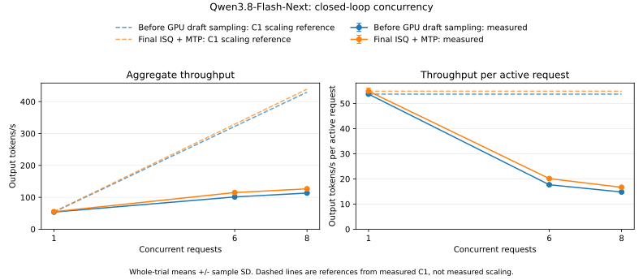

# Qwen3.8-Flash-Next on NVIDIA GB10

This directory contains the serving benchmark harness and results for the Qwen3.8-Flash-Next implementation, measured on September 29-30, 2026. The runs use identical prompts through `/v1/completions`, with one server running at a time.

## Results

Throughput in tokens/s, mean +/- sample standard deviation over five measured repetitions. Both GGUF columns use UD-Q4_K_XL; ISQ uses safetensors with `--isq q4k`; ISQ + MTP adds `--mtp` with adaptive draft depth. The llama.cpp serving run uses the allocation-padding fix described below, with its original kernels, fusion, and CUDA graphs.

| Workload | llama.cpp GGUF, patched | mistral.rs GGUF | mistral.rs ISQ | mistral.rs ISQ + MTP |
| --- | ---: | ---: | ---: | ---: |
| Prefill 512 | 868.3 +/- 10.2 | 1370.2 +/- 26.9 | 1341.0 +/- 20.0 | 1318.4 +/- 26.6 |
| Prefill 2048 | 881.8 +/- 22.5 | 1376.3 +/- 8.7 | 1333.2 +/- 10.6 | 1304.0 +/- 8.6 |
| Prefill 8192 | 870.6 +/- 9.0 | 1348.3 +/- 2.4 | 1313.5 +/- 2.3 | 1284.9 +/- 3.3 |
| Decode 128, synthetic 16-token input | 25.8 +/- 1.5 | 25.9 +/- 0.1 | 36.0 +/- 0.1 | 47.0 +/- 9.6 |
| Python | 26.4 +/- 0.0 | 26.3 +/- 0.0 | 36.0 +/- 0.0 | 54.6 +/- 1.0 |
| Rust | 26.3 +/- 0.0 | 26.3 +/- 0.0 | 36.0 +/- 0.0 | 57.3 +/- 1.3 |
| Prose | 26.7 +/- 0.0 | 26.5 +/- 0.0 | 36.3 +/- 0.0 | 48.3 +/- 1.2 |
| JSON | 26.5 +/- 0.1 | 26.2 +/- 0.0 | 35.8 +/- 0.0 | 49.2 +/- 1.1 |
| Primes | 26.6 +/- 0.0 | 26.4 +/- 0.0 | 36.2 +/- 0.0 | 54.7 +/- 2.5 |
| Math | 26.5 +/- 0.0 | 26.0 +/- 0.1 | 35.5 +/- 0.0 | 58.3 +/- 2.1 |
| Translation | 26.5 +/- 0.1 | 26.2 +/- 0.0 | 35.9 +/- 0.0 | 54.1 +/- 2.4 |
| Quicksort | 26.3 +/- 0.1 | 26.6 +/- 0.0 | 36.4 +/- 0.0 | 56.7 +/- 1.9 |
| Four-request burst, aggregate | 54.8 +/- 0.5 | 57.9 +/- 0.4 | 69.5 +/- 0.7 | 90.0 +/- 1.8 |
| Eight-request burst, aggregate | 66.2 +/- 0.1 | 74.7 +/- 0.3 | 84.5 +/- 0.2 | 124.7 +/- 1.8 |

Across the eight ordinary prompts, the arithmetic mean of per-prompt throughput is 26.5 tokens/s for patched llama.cpp, 26.3 for mistral.rs GGUF, 36.0 for ISQ, and 54.1 for ISQ + MTP. Same-GGUF ordinary decode differs by 0.6%. Against this patched reference, mistral.rs GGUF prefill is 55-58% faster and eight-request burst throughput is 13% higher in this run. These measurements do not support a claim of faster same-GGUF single-request decode.

MTP changes the mistral.rs ISQ ordinary-prompt mean by +50% and eight-request burst throughput by +48%. Prefill throughput changes range from -2.2% to -1.7% versus ISQ. These averages describe this prompt set, not a general expected speedup. A displayed standard deviation of 0.0 is rounded, not exactly zero.

Limited scaling also appears without MTP: target-only Flash-Next ISQ records 36.01 tokens/s as the arithmetic mean of the eight single-request prompt rates and 84.49 aggregate tokens/s in the eight-request burst, a 2.35x ratio. This is separate finite-burst evidence, not the closed-loop scaling ratio. It motivates investigating the target model's expert path alongside MTP; the comparison alone does not establish a kernel-level cause or a hardware ceiling. [Serving summary](summary.json) preserves the exact values.

The [raw responses and run metadata](raw/) and [machine-readable summary](summary.json) include all measured samples and validation requests.

### Sustained concurrency

These closed-loop trials replenish a request slot as soon as its response completes. Each request generates 128 tokens from the same eight ordinary prompts. C1 runs eight requests per trial; C6 and C8 run 24. The final and pre-exploration series use two discarded warmups and five measured trials. The earliest baseline, taken after scheduler and graph fixes but before GPU draft sampling, uses one warmup and three measured trials.

| Stage | Concurrency | Aggregate tokens/s | Tokens/s per active request | Mean active requests |
| --- | ---: | ---: | ---: | ---: |
| Before GPU draft sampling | 1 | 53.7 +/- 0.3 | 53.7 +/- 0.3 | 1.00 |
| Before GPU draft sampling | 6 | 101.2 +/- 0.5 | 17.7 +/- 0.2 | 5.72 |
| Before GPU draft sampling | 8 | 113.3 +/- 1.4 | 14.8 +/- 0.2 | 7.66 |
| Before depth exploration fix | 1 | 52.6 +/- 0.9 | 52.6 +/- 0.9 | 1.00 |
| Before depth exploration fix | 6 | 114.5 +/- 2.5 | 20.0 +/- 0.5 | 5.71 |
| Before depth exploration fix | 8 | 124.9 +/- 1.9 | 16.5 +/- 0.2 | 7.56 |
| Final ISQ + MTP | 1 | 54.9 +/- 1.2 | 54.9 +/- 1.2 | 1.00 |
| Final ISQ + MTP | 6 | 114.9 +/- 1.2 | 20.1 +/- 0.3 | 5.71 |
| Final ISQ + MTP | 8 | 126.6 +/- 2.0 | 16.6 +/- 0.2 | 7.61 |

Per-active-request throughput is total output tokens divided by the sum of request latencies, equivalent to 128 divided by mean request latency. It is latency-weighted and includes prompt processing. Mean active requests is summed request latency divided by trial wall time; it falls below the configured concurrency while the finite trial drains. Aggregate throughput divided by mean active requests gives the per-active-request rate within each trial.

The exploration correction did not materially close the scaling gap. The final C6 result is 20.1 tokens/s per active request and 114.9 aggregate tokens/s, compared with the requested 60 and 360 tokens/s targets. Relative to the pre-exploration stage, aggregate throughput changes by +4.3% at C1, +0.4% at C6, and +1.3% at C8. The C8 change from 124.9 to 126.6 tokens/s is a small stage difference, not a demonstrated causal speedup. The final series comes from a fresh server launched without a profiler.

[Saved counters](raw/scaling_investigation/final_metrics/README.md) bracket each whole subprocess, including discarded warmups and all trials. They give 79.3% draft-token acceptance and mean proposed depth 3.28 at C1, versus 66.4% and 5.18 across the combined C6/C8 phase. Target dispatches were 2,025 graph replays and 0 eager at C1, versus 720 replays and 1,065 eager dispatches for unsupported batch shapes across combined C6/C8. These counts do not measure kernel-time coverage. The snapshots cannot separate C6 from C8 and do not record depth distributions or actual expert occupancy.

The historical step from before GPU draft sampling to before depth exploration recorded +13% at C6 and +10% at C8, with C1 changing -2%. Both older series were timed after profiler shutdown, but their launchers used different Nsight versions (2025.6.3 and 2026.1.3). Those earlier improvements are historical observations, not attribution for the combined final changes. The [archived pre-exploration summary](raw/before_depth_exploration/concurrency.summary.json) preserves the intermediate samples; the transfer trace separately confirms reduced full-vocabulary device-to-host copies.



The plot shows the earliest baseline and final series; the intermediate stage appears only in the table. Dashed curves extrapolate measured C1 performance; they are scaling references, not measured performance. [Validated concurrency samples and summary](concurrency.summary.json) retain request latencies, trial variability, and separate burst cases. Completion-boundary estimates in the JSON count whole responses rather than streaming token arrivals and are excluded from this table and plot. The closed-loop results should not be substituted into the cross-engine burst comparison above. The [scaling investigation](scaling.md) compares the release context, a dense FP8 control on this GB10, and expert-kernel diagnostics.

### Backend and actual-route controls

A matched dense 27B control on the same GB10 and executable scales 7.30x with FP8 and 5.45x after Q4K ISQ; Q4K is still faster in absolute throughput at C1 and C8. This holds the checkpoint and requests fixed, but requantizes already-FP8 weights and changes eligible output-head precision and execution layout. Its C8 workload is one finite wave, not the sustained Flash-Next workload. An isolated dense FFN probe also shows different FP8/Q4K scaling; optional Marlin improves its Q4K eight-row time by 1.45x, with no full-model claim. [Dense backend results and limits](scaling.md#matched-dense-fp8-versus-q4k-execution-paths) preserve the controls.

Actual Flash-Next routes support grouped MMQ at the observed larger verification shapes: at 56 rows, the layer replay records 3.521 ms grouped versus 5.311 ms GEMV, with a 1.582x median paired speed ratio. Those inputs select a median 213 of 512 experts, with only 2.63 route assignments per selected expert. A separate single-input Nsight Compute profile shows about 17% achieved warp occupancy for grouped kernels using 254 registers per thread with a one-block-per-SM resource limit; GEMV has much higher occupancy but loses the larger-shape replay. DRAM counters were unavailable. These findings identify dispatch and resource constraints without establishing a bandwidth ceiling or a full-model speedup. [Actual routes, numerical checks, and profiler scope](scaling.md#captured-routes-and-gpu-resource-limits) distinguish native samples from derived controls and retain the original numerical-guard failure.

Smaller 16/32-column tiles gave no consistent gain. Streaming register fragments with default tiles made native 42/56-row replay about 6-7% slower. Combining streaming with the 16-column tile raised measured occupancy to 31-33% and allowed two blocks per SM, but still gave no convincing pipeline gain. Every candidate reproduced all 25 saved outputs exactly; none was adopted. [Measured negative results](scaling.md#measured-kernel-experiments) preserve the timings, resource counters, and scope.

The grouped MMQ kernel family predates Flash-Next support; this work adds three expert-ID bounds checks. Dense FP8 uses a different backend, and the default dense Q4K eight-row decode control uses MMVQ. Larger dense batches can use MMQ arithmetic without the MoE routing and expert groups. [Kernel history and dispatch evidence](scaling.md#kernel-provenance-and-dense-execution) distinguish existing implementation from the changes under review.

### llama.cpp native benchmark

The native `llama-bench` run completed successfully on the same GB10 and UD-Q4_K_XL shards, with BF16 KV, all layers on the GPU, flash attention enabled, and five repetitions. This uses the unmodified llama.cpp commit `4b1a27fa0`, built with CUDA 13.0.88.

| Native workload | Tokens/s, mean +/- sample standard deviation |
| --- | ---: |
| Prefill 512 | 943.0 +/- 16.7 |
| Prefill 2048 | 940.6 +/- 5.7 |
| Prefill 8192 | 893.0 +/- 6.8 |
| Decode 128 | 28.28 +/- 0.05 |

These are engine timings, separate from the serving table above. `llama-bench` feeds random token IDs without sampling generated text, excludes HTTP and tokenization, and sizes each context to its workload. Its prefill warmup is one full prompt; its decode warmup is one token. It clears the KV cache between repetitions. The serving benchmark includes request overhead, sampling, and prompt processing and uses a fixed 16,384-token context. Use the shared serving table for cross-engine comparisons; these native numbers cannot be compared directly with serving rates. [Raw native samples](raw/llama.native.json) and [build/command metadata](raw/llama.native.metadata.json) are included.

### llama.cpp serving fix

The unmodified server crashed on the first 512-token prefill request. The crash persisted in separate probes using F16 cache, one slot, or disabled fusion. CUDA memcheck and the failing instruction identified a read past the compact quantized activation buffer: the allocation did not reserve enough padding for the kernel's full 128-column tile. The [padding patch](raw/llama-indexed-mmq-padding.patch) reserves that tail space and also covers the index and optional scale buffers. An isolated library using this patch completes the same request under targeted memcheck without reported errors, passes five quantized matrix tests against the CPU reference, and completes the full serving benchmark. The [failure evidence](raw/llama.failure.json), [instruction analysis](raw/mmq-padding-analysis.txt), and [build manifest](raw/shadow-build.manifest.json) are preserved. The original inference binaries and source files were left unchanged.

### GPU profiling

Separate historical C8 full-model Nsight Systems captures recorded 2,913 full-vocabulary F32 device-to-host transfers before GPU draft sampling and 5 in the subsequent, pre-depth-exploration stage. Expert matrix kernels account for 69.62% of summed kernel duration in that later historical capture; the union of recorded kernel, copy, and memset activity covers 95.45% of its kernel-span interval. These are not captures of the final autotuner binary or the isolated Nsight Compute experiment above. The corresponding serving and concurrency stage is archived under [before_depth_exploration](raw/before_depth_exploration/provenance.json).

These quantities describe traced activity, not bandwidth utilization or a physical throughput ceiling. Those traces did not collect bandwidth counters, software tracing adds overhead, and the reports warn that some CUDA events may be missing. The final server was launched without Nsight; use its serving and concurrency measurements for final throughput claims. [Trace findings](raw/profile/profile_findings.txt), [transfer evidence](raw/profile/draft_sampling_transfer_evidence.json), and [analysis provenance and reproduction instructions](raw/profile/README.txt) retain the historical definitions and caveats.

## Subsequent MoE optimization

The [optimization report](optimization.md) records the first adopted kernel change: masking unused grouped-MMQ activation columns. Native C8-shaped layer replays improve by about 4%, with byte-identical outputs and passing independent CUDA regressions. This is an isolated layer measurement; the serving tables above retain their original binaries and results.

## Method

- NVIDIA GB10, 128 GB unified system memory, NVIDIA driver 580.126.09.
- mistral.rs release build with `cuda,flash-attn,cutile` and CUDA 13.2; llama.cpp commit `4b1a27fa0` built with CUDA 13.0.88, plus the documented padding patch for serving.
- Safetensors revision `de4b8e4d43b917e7706784d8bb445c9af86a3540`, quantized with `--isq q4k`.
- The llama.cpp reference uses the same local UD-Q4_K_XL shards. Safetensors ISQ and UD-Q4_K_XL use different quantization choices and are reported separately.
- BF16 KV caches, 16,384-token context, up to eight concurrent requests, prefix reuse disabled.
- Two discarded warmups and five measured repetitions per timed case. Model loading, quantization, and startup compilation are excluded.
- Greedy sampling, fixed seed, EOS ignored, 128 generated tokens. Synthetic prefill cases generate one token. Input and tokenizer hashes are recorded with the samples.
- Timed requests do not request logprobs. Separate requests inspect finite token logprobs, including a long repetitive input. Requesting logprobs changes MTP verification and should not be mixed into ordinary decoding timings.

All summary throughput uses client wall-clock time. `ppN` is N input tokens divided by the time to receive a one-token completion, including request overhead and the first token. Decoding is output tokens divided by total request time, including prompt processing. Concurrent throughput is total output tokens divided by the duration of the entire batch. These measurements differ from native engine-only `llama-bench` timings. Reported variability is sample standard deviation, not a confidence interval.

Per-run metadata records the commands, source revision, source diff hash, and binary hash. The GGUF and non-MTP ISQ columns retain their earlier baseline binaries. The first ISQ process predates the pre-load device-placement correction; it loaded all 48 layers on the GPU and allocated 513 cache blocks. The final MTP column uses the rebuilt binary with scheduler fairness, shared draft-depth batching, grouped MMQ bounds fixes, expanded CUDA graph coverage, committed-token telemetry, GPU draft sampling, and corrected autotuner exploration. Its [metadata](raw/isq_mtp.metadata.json) identifies that binary. Earlier MTP results are preserved separately in [pre_batching_fix](raw/pre_batching_fix/provenance.json), [before_gpu_draft_sampling](raw/before_gpu_draft_sampling/provenance.json), and [before_depth_exploration](raw/before_depth_exploration/provenance.json); they are excluded from the serving table.

The final MTP server was launched directly without Nsight, and background editor compilation was stopped before its timed requests. The editor's two background Cargo check subtrees were cancelled to release memory; the rust-analyzer parent remained paused through timing. The [cleanup record](raw/isq_mtp.editor_cleanup.json), [recorded commands](raw/isq_mtp.commands.json), and [pre-measurement provenance](raw/isq_mtp.pre_measurement_provenance.json) preserve these conditions. In the preceding pre-exploration stage, the profiler was shut down with `--kill=none` while the model server stayed alive; those [older commands](raw/before_depth_exploration/isq_mtp.commands.json) apply only to the archived stage. Profiled requests are excluded from throughput results.

[Memory boundary snapshots](raw/scaling_investigation/final_memory/summary.json) recorded no system swap-out during serving or concurrency commands. System swap-in occurred, including 151 MiB across the combined C6/C8 command; model process `VmSwap` remained approximately 477 MiB at its boundaries. These global counters bracket whole subprocesses, including warmups, and cannot identify model-specific page-ins or their effect on individual timed trials.

The mistral.rs GGUF server also loads the approximately 908 MB vision projector. The text-only llama.cpp reference does not. No cross-engine memory comparison is made.

Built-in MTP is tested from safetensors. GGUF built-in MTP is unsupported and now reports an error instead of silently running ordinary decoding. Built-in Qwen MTP recomputes prefixes because its shifted-token state cannot safely share the target's token-only prefix-cache identities.

## Validation

The final source passes `cargo check --workspace --all-targets`, the CUDA release build, and CUDA release Clippy with warnings denied for the CLI, core, quantization, vision, server, and public API crates. Formatting, typo checks, CLI reference generation, and the documentation build also pass. [Final build and validation logs](raw/validation/) are preserved.

The subsequent kernel investigation adds CUDA benchmark tests and reports, with no experimental kernel rewrite adopted. The quantization crate's CUDA test check, Clippy for both added benchmark targets with warnings denied, formatting, and diff checks pass. The [investigation validation record](raw/validation/kernel_investigation/validation.json) also records byte-identical outputs for all 25 inputs under each of four variants. An additional CUDA-enabled whole-workspace check, including Python bindings, was cancelled while rebuilding unchanged GDN code in a separate Cargo cache; it is not counted as a passing check.

Focused regressions cover speculative decoding, QSA rollback, cuTile sparse attention and GDN prefill, cache sizing, GGUF configuration and projector loading, CLI arguments, public builder errors, scheduler fairness and shared draft-depth batches, and committed-token logging. Grouped MMQ graph replay tests exercise updated inputs and expert routes after workspace growth. Four CUDA draft-sampling tests cover greedy CPU agreement, masks and context updates, mixed sampling penalties and processors, stochastic RNG consumption, and rejection of invalid logits. All four also pass under Compute Sanitizer with [zero reported errors](raw/validation/draft_sampling_memcheck.log). The grouped MMQ graph replay tests likewise pass [CUDA memcheck with zero errors](raw/validation/grouped_mmq_memcheck.log).

All [24 autotuner tests](raw/validation/tuner.autotuner_tests.log) pass, including exploration across a slower neighboring depth. The [red/green regression evidence](raw/scaling_investigation/autotuner_red_green/results.json) applies an identical test to the old and corrected exploration logic: the old logic fails and the corrected logic passes. Its source snapshots, compilation logs, and test logs are preserved beside the results.

GPU execution was checked on this GB10. Multi-GPU placement and other GPU architectures were not exercised on hardware.

All four serving runs pass the shared validator: complete samples, matching input hashes and token counts, no reported prefix reuse, and finite validation logprobs. The GGUF vision check correctly identifies the red rectangle and blue circle in the saved input image. The mistral.rs GGUF, ISQ+MTP, and patched llama.cpp chat checks return a correct sentence after the long repetitive prompt with thinking disabled.

The [mixed-context smoke test](raw/isq_mtp.mixed_context.json) also passes: eight concurrent requests spanning 1,024- and 2,304-token inputs each produce 128 tokens with finite logprobs, covering both sides of the QSA threshold.

These are throughput and smoke tests, not an answer-quality evaluation. The fixed output lengths often stop during reasoning or code generation. Greedy text also varies across repeated mistral.rs requests, including without MTP; its quantized expert kernel uses unordered floating-point atomic additions. The raw output comparisons preserve those differences, and finite logprobs alone do not establish exact MTP equivalence.

## Reproduce

Build the CLI:

```bash
cargo build --release -p mistralrs-cli --features cuda,flash-attn,cutile
```

Start the safetensors server, adding `--mtp` for the MTP configuration:

```bash
target/release/mistralrs serve -m "$FLASH_NEXT_MODEL_DIR" --isq q4k \
  --max-model-len 16384 --max-seqs 8 --prefix-cache-n 0 --no-ui -p 1234
```

For GGUF, replace the model and quantization arguments with `-m "$FLASH_NEXT_GGUF_DIR" -f "$FLASH_NEXT_GGUF_SHARDS" --mmproj "$FLASH_NEXT_PROJECTOR"`. `FLASH_NEXT_GGUF_SHARDS` is the semicolon-separated list of four shard filenames.

For the serving reference, use a separate llama.cpp checkout at `4b1a27fa0` with a configured CUDA release build. Apply the included patch and rebuild:

```bash
git -C "$LLAMA_CPP_DIR" apply \
  "$PWD/benchmarks/qwen3.8-flash-next/raw/llama-indexed-mmq-padding.patch"
cmake --build "$LLAMA_CPP_DIR/build" --target llama-server -j 8
```

Start the patched reference server:

```bash
"$LLAMA_CPP_DIR/build/bin/llama-server" \
  -m "$FLASH_NEXT_GGUF_FIRST_SHARD" --host 127.0.0.1 --port 1234 \
  --alias default -ngl 99 -fa on -c 16384 -np 8 --kv-unified \
  --kv-unified-per-slot 16384 -ctk bf16 -ctv bf16 --cache-ram 0 --no-context-shift
```

The measured run instead loaded an isolated replacement CUDA library through `LD_LIBRARY_PATH`; its exact paths, library hashes, and patch hash are in [run metadata](raw/llama_patched.metadata.json).

Reproduce the native run from an unmodified checkout at the same commit:

```bash
llama-bench -m "$FLASH_NEXT_GGUF_FIRST_SHARD" -ngl 99 -fa on \
  -ctk bf16 -ctv bf16 -b 2048 -ub 512 -t 20 \
  -p 512,2048,8192 -n 128 -r 5 -o json --progress
```

Run the harness once for each server, changing `--label` and `--output`. It needs the Python `tokenizers` package:

```bash
python3 benchmarks/qwen3.8-flash-next/bench_serving.py \
  --tokenizer "$FLASH_NEXT_MODEL_DIR/tokenizer.json" \
  --label isq --output isq.json
```

Summarize the raw files with a common timing definition and verify matching input hashes:

```bash
python3 benchmarks/qwen3.8-flash-next/summarize.py \
  benchmarks/qwen3.8-flash-next/raw/llama_patched.json \
  benchmarks/qwen3.8-flash-next/raw/gguf.json \
  benchmarks/qwen3.8-flash-next/raw/isq.json \
  benchmarks/qwen3.8-flash-next/raw/isq_mtp.json --output summary.json
```

The summary rejects incomplete runs, mismatched harnesses or settings, different input/token counts, and missing or non-finite validation logprobs. Its JSON separates `validation`, `throughput`, and `output_comparisons`. Output diagnostics compare repeated timed requests, validation requests against timed requests, and `isq_mtp` against `isq`; they record text differences without treating numerical or batching differences as automatic failures.

Run replenished closed-loop traffic separately from the serving harness's single bursts. These commands use eight requests per C1 trial and 24 per C6/C8 trial, with two discarded warmups and five measured trials:

```bash
python3 benchmarks/qwen3.8-flash-next/bench_concurrency.py \
  --tokenizer "$FLASH_NEXT_MODEL_DIR/tokenizer.json" --label isq_mtp_tuner \
  --concurrencies 1 --requests 8 --modes closed-loop \
  --warmup 2 --trials 5 --output concurrency.c1.json
python3 benchmarks/qwen3.8-flash-next/bench_concurrency.py \
  --tokenizer "$FLASH_NEXT_MODEL_DIR/tokenizer.json" --label isq_mtp_tuner \
  --concurrencies 6 8 --requests 24 --modes closed-loop \
  --warmup 2 --trials 5 --output concurrency.c6_c8.json
python3 benchmarks/qwen3.8-flash-next/bench_concurrency.py \
  --tokenizer "$FLASH_NEXT_MODEL_DIR/tokenizer.json" --label isq_mtp_tuner \
  --concurrencies 6 --requests 24 --modes burst \
  --warmup 2 --trials 5 --output concurrency.burst_c6.json
python3 benchmarks/qwen3.8-flash-next/summarize_concurrency.py \
  concurrency.c1.json concurrency.c6_c8.json concurrency.burst_c6.json \
  --output concurrency.summary.json
python3 benchmarks/qwen3.8-flash-next/plot_concurrency.py \
  concurrency.summary.json --output-prefix concurrency
```

The concurrency harness cycles evenly through the same eight prompts with 128 output tokens per request, no logprobs, and prefix reuse disabled. Burst mode waits for each group of C requests to finish before submitting the next group. Closed-loop mode immediately replaces each completed request until the trial's request count is exhausted. `--concurrencies`, `--requests`, `--max-tokens`, `--warmup`, and `--trials` can be changed for other workloads.

The validator checks completed trials, shared hashes and settings, prompt and output token counts, and recomputes metrics from raw timestamps and responses. Whole-trial aggregate throughput is total output tokens divided by wall time. Mean active requests is summed request latency divided by wall time. Latency-weighted throughput per active request is total output tokens divided by summed request latency, or 128 divided by mean request latency for these fixed-length outputs. This accounts for startup and drain when fewer than C requests are active. The optional interior estimate counts whole completed responses between the first completion and last replacement submission; it is a completion-boundary estimate, not a streaming token rate.

The plotter requires the Python `matplotlib` package and writes standalone SVG and PNG figures for closed-loop rows with sample-standard-deviation error bars. Its dashed C1 scaling lines are references derived from measured C1, not additional measurements.

With a multimodal server running, check image input using the Python `Pillow` package:

```bash
python3 benchmarks/qwen3.8-flash-next/image_smoke.py gguf.image.json
```

This saves `gguf.image.png` beside the raw response JSON and prints the model's description for inspection. The image contains a red rectangle and a blue circle; the request allows 96 output tokens with thinking disabled.

Inspect an answer after the same long repetitive input used by the benchmark:

```bash
python3 benchmarks/qwen3.8-flash-next/text_smoke.py gguf.text.json
```

This separate chat request disables thinking and allows up to 128 output tokens. It saves the request and response together and prints the message for inspection, without adding a timed benchmark sample. Both smoke scripts accept `--base-url` for a server on another address.

Check mixed dense and sparse QSA contexts with MTP enabled:

```bash
python3 benchmarks/qwen3.8-flash-next/mixed_context_smoke.py mixed_context.json \
  --tokenizer "$FLASH_NEXT_MODEL_DIR/tokenizer.json"
```

This correctness smoke submits eight concurrent completions: four distinct seeded 2,304-token prompts and four distinct seeded 1,024-token prompts, each requesting 128 tokens with greedy sampling, EOS ignored, prefix reuse disabled, and token logprobs. The combined prompt-plus-output demand is 14,336 tokens. It checks token counts and finite logprobs, saves exact requests, raw responses, hashes, and per-request failures, and exits nonzero if any request fails. It makes no throughput or answer-quality claim and accepts `--base-url` for a different server address.
