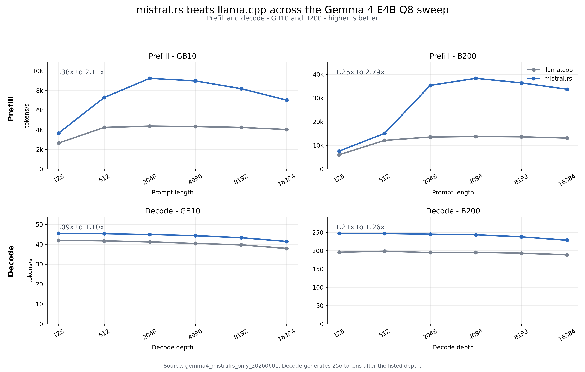
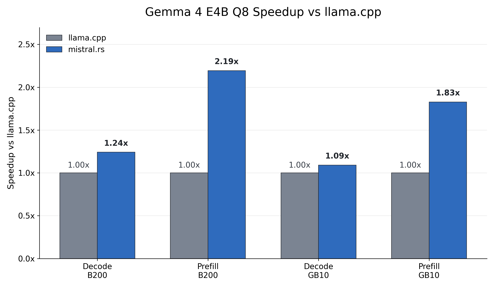
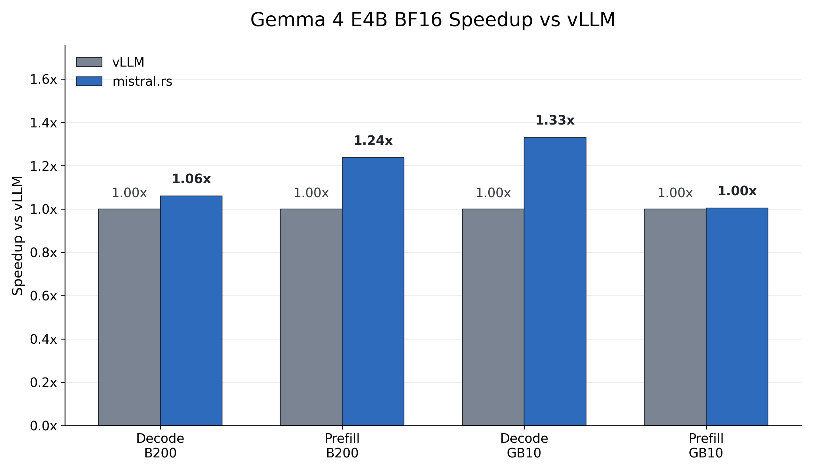

# mistral.rs v0.8.2 Report

## Benchmark Results

The release figures cover Gemma 4 E4B on GB10 and B200. Values are tokens per second, and speedups are mistral.rs divided by the comparison engine at the same length or decode depth.



| Mode | Hardware | mistral.rs Q8 speedup range vs llama.cpp |
|---|---|---:|
| Prefill | GB10 | 1.382x to 2.113x |
| Decode | GB10 | 1.086x to 1.097x |
| Prefill | B200 | 1.246x to 2.793x |
| Decode | B200 | 1.210x to 1.263x |



| Mode | Hardware | Mean speedup vs llama.cpp | Points |
|---|---|---:|---:|
| Decode | B200 | 1.242x | 6 |
| Prefill | B200 | 2.194x | 6 |
| Decode | GB10 | 1.090x | 6 |
| Prefill | GB10 | 1.828x | 6 |



| Mode | Hardware | Mean speedup vs vLLM | Points |
|---|---|---:|---:|
| Decode | B200 | 1.060x | 6 |
| Prefill | B200 | 1.238x | 6 |
| Decode | GB10 | 1.331x | 6 |
| Prefill | GB10 | 1.005x | 6 |

Headline observations from the release artifacts:

- For Gemma 4 E4B Q8, mistral.rs is faster than llama.cpp on every GB10 and B200 point in the release CSV. Mean prefill speedup is 1.828x on GB10 and 2.194x on B200; mean decode speedup is 1.090x on GB10 and 1.242x on B200.
- For Gemma 4 E4B BF16, mistral.rs is effectively tied with vLLM on GB10 prefill at 1.005x mean speedup, faster on GB10 decode at 1.331x, faster on B200 prefill at 1.238x, and faster on B200 decode at 1.060x.
- The full appendix also includes Gemma 4 26B-A4B and H100 SXM. Those data are useful for technical inspection but are not part of the headline release figures.

## Method

- Workloads: prompt lengths and decode depths of 128, 512, 2048, 4096, 8192, and 16384 tokens.
- Decode workload: 256 generated tokens at each requested depth.
- Iteration policy: 1 warmup iteration and 3 measured iterations.
- mistral.rs configuration: paged attention enabled with `--max-seq-len 16896 --pa-context-len 16896`. GB10 and B200 logs report 16864 usable tokens, covering the 16384 plus 256 decode case.
- Quantized comparisons: mistral.rs UQFF q4 is compared with llama.cpp GGUF Q4_K_M; mistral.rs UQFF q8 is compared with llama.cpp GGUF Q8_0.
- BF16 comparison: mistral.rs safetensors are compared with vLLM BF16.
- GB10 and B200 mistral.rs rows were rerun on 2026-06-01 after the Gemma 4 KV-sharing correctness fix. Their llama.cpp and vLLM comparison rows are copied from the prior 2026-05-31 full sweep and were not rerun for this report.
- H100 mistral.rs rows were rerun on 2026-06-01 on the H100 SXM host. H100 llama.cpp and vLLM rows are copied from the 2026-05-31 H100 sweep raw artifacts.
- Copied H100 llama.cpp rows use `llama-bench` with `-ngl 99 -fa 1`, as recorded in the H100 source report metadata and llama.cpp JSON fields.
- H100 vLLM rows use the single-request sweep script reproduced below with vLLM 0.19.0, Transformers 5.9.0, and Torch 2.10.0+cu128.

## Commands and Reproducibility

### Sweep Settings

```bash
CTX=16896
ITER=3
WARMUP=1
GEN=256
LENGTHS=128,512,2048,4096,8192,16384
```

### Entrypoints

B200 used the same `bench` command shapes shown below.

### GB10 Commands

```bash
# gb10_e4b_q4k
target/release/mistralrs bench -m google/gemma-4-E4B-it --quant 4 --paged-attn on --max-seq-len 16896 --pa-context-len 16896 --prompt-len 128,512,2048,4096,8192,16384 --depth 128,512,2048,4096,8192,16384 --gen-len 256 --iterations 3 --warmup 1

# gb10_e4b_q8
target/release/mistralrs bench -m google/gemma-4-E4B-it --quant 8 --paged-attn on --max-seq-len 16896 --pa-context-len 16896 --prompt-len 128,512,2048,4096,8192,16384 --depth 128,512,2048,4096,8192,16384 --gen-len 256 --iterations 3 --warmup 1

# gb10_e4b_bf16
target/release/mistralrs bench -m google/gemma-4-E4B-it --paged-attn on --max-seq-len 16896 --pa-context-len 16896 --prompt-len 128,512,2048,4096,8192,16384 --depth 128,512,2048,4096,8192,16384 --gen-len 256 --iterations 3 --warmup 1

# gb10_26b_q4k
target/release/mistralrs bench -m google/gemma-4-26B-A4B-it --quant 4 --paged-attn on --max-seq-len 16896 --pa-context-len 16896 --prompt-len 128,512,2048,4096,8192,16384 --depth 128,512,2048,4096,8192,16384 --gen-len 256 --iterations 3 --warmup 1

# gb10_26b_q8
target/release/mistralrs bench -m google/gemma-4-26B-A4B-it --quant 8 --paged-attn on --max-seq-len 16896 --pa-context-len 16896 --prompt-len 128,512,2048,4096,8192,16384 --depth 128,512,2048,4096,8192,16384 --gen-len 256 --iterations 3 --warmup 1

# gb10_26b_bf16
target/release/mistralrs bench -m google/gemma-4-26B-A4B-it --paged-attn on --max-seq-len 16896 --pa-context-len 16896 --prompt-len 128,512,2048,4096,8192,16384 --depth 128,512,2048,4096,8192,16384 --gen-len 256 --iterations 3 --warmup 1
```

### B200 Commands

```bash
# b200_e4b_q4k
target/release/mistralrs bench -m google/gemma-4-E4B-it --quant 4 --paged-attn on --max-seq-len 16896 --pa-context-len 16896 --prompt-len 128,512,2048,4096,8192,16384 --depth 128,512,2048,4096,8192,16384 --gen-len 256 --iterations 3 --warmup 1

# b200_e4b_q8
target/release/mistralrs bench -m google/gemma-4-E4B-it --quant 8 --paged-attn on --max-seq-len 16896 --pa-context-len 16896 --prompt-len 128,512,2048,4096,8192,16384 --depth 128,512,2048,4096,8192,16384 --gen-len 256 --iterations 3 --warmup 1

# b200_e4b_bf16
target/release/mistralrs bench -m google/gemma-4-E4B-it --paged-attn on --max-seq-len 16896 --pa-context-len 16896 --prompt-len 128,512,2048,4096,8192,16384 --depth 128,512,2048,4096,8192,16384 --gen-len 256 --iterations 3 --warmup 1

# b200_26b_q4k
target/release/mistralrs bench -m google/gemma-4-26B-A4B-it --quant 4 --paged-attn on --max-seq-len 16896 --pa-context-len 16896 --prompt-len 128,512,2048,4096,8192,16384 --depth 128,512,2048,4096,8192,16384 --gen-len 256 --iterations 3 --warmup 1

# b200_26b_q8
target/release/mistralrs bench -m google/gemma-4-26B-A4B-it --quant 8 --paged-attn on --max-seq-len 16896 --pa-context-len 16896 --prompt-len 128,512,2048,4096,8192,16384 --depth 128,512,2048,4096,8192,16384 --gen-len 256 --iterations 3 --warmup 1

# b200_26b_bf16
target/release/mistralrs bench -m google/gemma-4-26B-A4B-it --paged-attn on --max-seq-len 16896 --pa-context-len 16896 --prompt-len 128,512,2048,4096,8192,16384 --depth 128,512,2048,4096,8192,16384 --gen-len 256 --iterations 3 --warmup 1
```

### H100 mistral.rs Command Template

```bash
target/release/mistralrs bench -m "$MODEL" --paged-attn on \
  --max-seq-len "$CTX" --pa-context-len "$CTX" \
  --prompt-len "$LEN" --depth "$LEN" --gen-len "$GEN" \
  --iterations "$ITER" --warmup "$WARMUP"

# UQFF variants add one of:
--from-uqff 4
--from-uqff 8
```

### Model Artifacts

| Artifact | HF repo id | Revision recorded in reports | Use |
|---|---|---|---|
| Gemma 4 E4B BF16 | google/gemma-4-E4B-it | d6436b3d62967e1af08bbb046c6300b2a9ae8e85 | BF16 safetensors |
| Gemma 4 26B-A4B BF16 | google/gemma-4-26B-A4B-it | 6e6f6edea8c52db2094dca3086e4b963a0034dfc | BF16 safetensors |
| Gemma 4 E4B UQFF | mistralrs-community/gemma-4-E4B-it-UQFF | 0dcf5919591d49d7ef7001983eafa6f0e6b901cc | Used by `--quant 4`, `--quant 8`, or explicit H100 snapshot path |
| Gemma 4 26B-A4B UQFF | mistralrs-community/gemma-4-26B-A4B-it-UQFF | b4fb085fe7169cd8c60488e05899a3e0095a0122 | Used by `--quant 4`, `--quant 8`, or explicit H100 snapshot path |

GB10 and B200 logs record the base HF model IDs and UQFF repo selected by `--quant`; the resolved UQFF snapshot hashes above are recorded by the H100 download script.

GGUF artifacts recorded in the llama.cpp JSON rows:

- `Gemma 4 E4B Q4_K_M`: `gemma-4-E4B-it-Q4_K_M.gguf`.
- `Gemma 4 E4B Q8_0`: `gemma-4-e4b-it-Q8_0.gguf`.
- `Gemma 4 26B-A4B Q4_K_M`: `gemma-4-26B-A4B-it-Q4_K_M.gguf`.
- `Gemma 4 26B-A4B Q8_0`: `gemma-4-26B-A4B-it-Q8_0.gguf`.

### Versions and Commits

| Component | Commit or version | Notes |
|---|---|---|
| mistral.rs | 8b49f96392a767ea25a08af27669999a20e8a59e | branch `cuda_graphs_v1`; release `v0.8.2`; features `cuda,cudnn,flash-attn,cutile` |
| llama.cpp | 751ebd17a58a8a513994509214373bb9e6a3d66c | |
| vLLM | 73dd2f33b7a5a8a237fe7296039cec246e4c68bd | `vllm 0.21.0`, `torch 2.11.0+cu130` |

Host metadata:

- GB10: NVIDIA GB10, driver 580.126.09, release `v0.8.2`.
- B200: NVIDIA B200, driver 580.126.20, CUDA 13.0, 183359 MiB GPU memory, release `v0.8.2`.
- H100 SXM: NVIDIA H100 80GB HBM3, driver 570.124.06, CUDA 12.8, rustc 1.96.0, cargo 1.96.0, release `v0.8.2`.

### vLLM Bench Script

```python
import argparse
import json
import statistics
from pathlib import Path

from vllm import LLM, SamplingParams


LENGTHS = [128, 512, 2048, 4096, 8192, 16384]


def prompt_tokens(n: int) -> list[int]:
    return list(range(1000, 1000 + n))


def run_one(llm: LLM, prompt_len: int, output_len: int) -> tuple[float, float, int]:
    params = SamplingParams(
        temperature=0.0,
        max_tokens=output_len,
        min_tokens=output_len,
        ignore_eos=True,
    )
    out = llm.generate(
        [{"prompt_token_ids": prompt_tokens(prompt_len)}],
        params,
        use_tqdm=False,
    )[0]
    metrics = out.metrics
    if metrics is None:
        raise RuntimeError("vLLM did not return request metrics")
    prefill = metrics.first_token_ts - metrics.scheduled_ts
    decode = metrics.last_token_ts - metrics.first_token_ts
    generated = len(out.outputs[0].token_ids)
    return prefill, decode, generated


def mean(values: list[float]) -> float:
    return statistics.fmean(values)


def stdev(values: list[float]) -> float:
    return statistics.pstdev(values) if len(values) > 1 else 0.0


def main() -> None:
    parser = argparse.ArgumentParser()
    parser.add_argument("--model", required=True)
    parser.add_argument("--max-model-len", type=int, default=32768)
    parser.add_argument("--iterations", type=int, default=3)
    parser.add_argument("--warmup", type=int, default=1)
    parser.add_argument("--output-json", required=True)
    parser.add_argument("--gpu-memory-utilization", type=float, default=0.92)
    args = parser.parse_args()

    llm = LLM(
        model=args.model,
        runner="generate",
        dtype="bfloat16",
        max_model_len=args.max_model_len,
        gpu_memory_utilization=args.gpu_memory_utilization,
        enable_prefix_caching=False,
        seed=0,
        trust_remote_code=True,
        disable_log_stats=False,
        limit_mm_per_prompt={"image": 0, "video": 0, "audio": 0},
    )

    for _ in range(args.warmup):
        run_one(llm, 32, 16)
        for length in LENGTHS:
            run_one(llm, length, 1)
            run_one(llm, length, 256)

    rows = []
    for length in LENGTHS:
        prefill_times = []
        for _ in range(args.iterations):
            prefill, _, _ = run_one(llm, length, 1)
            prefill_times.append(prefill)
        prefill_tps = [length / t for t in prefill_times]
        rows.append(
            {
                "mode": "prefill",
                "length": length,
                "tokens_per_second": mean(prefill_tps),
                "stddev": stdev(prefill_tps),
                "seconds": mean(prefill_times),
            }
        )

    for length in LENGTHS:
        decode_times = []
        generated_counts = []
        for _ in range(args.iterations):
            _, decode, generated = run_one(llm, length, 256)
            decode_times.append(decode)
            generated_counts.append(generated)
        decode_tps = [
            max(generated - 1, 0) / t if t > 0 else 0.0
            for t, generated in zip(decode_times, generated_counts)
        ]
        rows.append(
            {
                "mode": "decode",
                "length": length,
                "tokens_per_second": mean(decode_tps),
                "stddev": stdev(decode_tps),
                "seconds": mean(decode_times),
                "generated_tokens": mean(generated_counts),
            }
        )

    Path(args.output_json).write_text(json.dumps({"model": args.model, "rows": rows}, indent=2))

    print(f"Model: {args.model}")
    print("| Mode | Length | T/s | Stddev | Seconds |")
    print("|---|---:|---:|---:|---:|")
    for row in rows:
        print(
            f"| {row['mode']} | {row['length']} | "
            f"{row['tokens_per_second']:.1f} | {row['stddev']:.1f} | {row['seconds']:.4f} |"
        )


if __name__ == "__main__":
    main()
```

## Appendix: Full Tables

All appendix values are tokens per second. The speedup column is mistral.rs divided by the comparison engine in the same row.

### GB10

#### Gemma 4 E4B

##### Q4_K_M Prefill

| Length | mistral.rs UQFF q4 | llama.cpp GGUF Q4_K_M | mistral.rs speedup |
|---:|---:|---:|---:|
| 128 | 4643.5 | 3170.7 | 1.465x |
| 512 | 7747.0 | 4666.9 | 1.660x |
| 2048 | 8605.9 | 4762.2 | 1.807x |
| 4096 | 8663.2 | 4678.4 | 1.852x |
| 8192 | 7945.7 | 4578.6 | 1.735x |
| 16384 | 7021.9 | 4315.8 | 1.627x |

##### Q4_K_M Decode

| Depth | mistral.rs UQFF q4 | llama.cpp GGUF Q4_K_M | mistral.rs speedup |
|---:|---:|---:|---:|
| 128 | 68.0 | 61.6 | 1.104x |
| 512 | 67.4 | 61.2 | 1.101x |
| 2048 | 66.5 | 60.2 | 1.105x |
| 4096 | 65.3 | 58.6 | 1.114x |
| 8192 | 63.3 | 57.2 | 1.107x |
| 16384 | 59.2 | 53.7 | 1.102x |

##### Q8_0 Prefill

| Length | mistral.rs UQFF q8 | llama.cpp GGUF Q8_0 | mistral.rs speedup |
|---:|---:|---:|---:|
| 128 | 3657.1 | 2645.4 | 1.382x |
| 512 | 7289.5 | 4238.1 | 1.720x |
| 2048 | 9239.8 | 4372.2 | 2.113x |
| 4096 | 8976.2 | 4327.8 | 2.074x |
| 8192 | 8189.7 | 4235.7 | 1.933x |
| 16384 | 7021.8 | 4023.0 | 1.745x |

##### Q8_0 Decode

| Depth | mistral.rs UQFF q8 | llama.cpp GGUF Q8_0 | mistral.rs speedup |
|---:|---:|---:|---:|
| 128 | 45.5 | 41.9 | 1.086x |
| 512 | 45.3 | 41.7 | 1.086x |
| 2048 | 44.9 | 41.2 | 1.090x |
| 4096 | 44.3 | 40.4 | 1.097x |
| 8192 | 43.3 | 39.7 | 1.091x |
| 16384 | 41.4 | 37.9 | 1.092x |

##### BF16 Prefill

| Length | mistral.rs BF16 | vLLM BF16 | mistral.rs speedup |
|---:|---:|---:|---:|
| 128 | 2401.3 | 2401.6 | 1.000x |
| 512 | 5688.9 | 6265.5 | 0.908x |
| 2048 | 7288.3 | 7180.7 | 1.015x |
| 4096 | 7090.7 | 7060.4 | 1.004x |
| 8192 | 6667.5 | 6451.5 | 1.033x |
| 16384 | 5896.5 | 5517.7 | 1.069x |

##### BF16 Decode

| Depth | mistral.rs BF16 | vLLM BF16 | mistral.rs speedup |
|---:|---:|---:|---:|
| 128 | 25.2 | 19.3 | 1.306x |
| 512 | 25.6 | 19.3 | 1.326x |
| 2048 | 25.4 | 19.1 | 1.330x |
| 4096 | 25.2 | 18.9 | 1.333x |
| 8192 | 24.9 | 18.5 | 1.346x |
| 16384 | 24.2 | 18.0 | 1.344x |

#### Gemma 4 26B-A4B

##### Q4_K_M Prefill

| Length | mistral.rs UQFF q4 | llama.cpp GGUF Q4_K_M | mistral.rs speedup |
|---:|---:|---:|---:|
| 128 | 1662.5 | 1461.3 | 1.138x |
| 512 | 3354.5 | 2855.8 | 1.175x |
| 2048 | 3932.4 | 2863.0 | 1.374x |
| 4096 | 3888.7 | 2781.8 | 1.398x |
| 8192 | 3556.1 | 2791.3 | 1.274x |
| 16384 | 3000.6 | 2659.6 | 1.128x |

##### Q4_K_M Decode

| Depth | mistral.rs UQFF q4 | llama.cpp GGUF Q4_K_M | mistral.rs speedup |
|---:|---:|---:|---:|
| 128 | 71.1 | 67.4 | 1.055x |
| 512 | 69.4 | 65.8 | 1.055x |
| 2048 | 67.0 | 62.1 | 1.079x |
| 4096 | 65.9 | 62.1 | 1.061x |
| 8192 | 64.0 | 59.7 | 1.072x |
| 16384 | 60.8 | 57.7 | 1.054x |

##### Q8_0 Prefill

| Length | mistral.rs UQFF q8 | llama.cpp GGUF Q8_0 | mistral.rs speedup |
|---:|---:|---:|---:|
| 128 | 1255.5 | 1118.7 | 1.122x |
| 512 | 2728.6 | 2424.5 | 1.125x |
| 2048 | 3723.6 | 2452.1 | 1.519x |
| 4096 | 3745.2 | 2415.8 | 1.550x |
| 8192 | 3336.0 | 2374.6 | 1.405x |
| 16384 | 2893.1 | 2285.2 | 1.266x |

##### Q8_0 Decode

| Depth | mistral.rs UQFF q8 | llama.cpp GGUF Q8_0 | mistral.rs speedup |
|---:|---:|---:|---:|
| 128 | 49.2 | 49.0 | 1.004x |
| 512 | 48.4 | 48.1 | 1.006x |
| 2048 | 47.0 | 46.2 | 1.017x |
| 4096 | 46.4 | 46.0 | 1.009x |
| 8192 | 45.6 | 44.9 | 1.016x |
| 16384 | 43.9 | 43.9 | 1.000x |

##### BF16 Prefill

| Length | mistral.rs BF16 | vLLM BF16 | mistral.rs speedup |
|---:|---:|---:|---:|
| 128 | 418.9 | 1014.3 | 0.413x |
| 512 | 710.8 | 2728.8 | 0.260x |
| 2048 | 666.7 | 4686.1 | 0.142x |
| 4096 | 595.0 | 5201.2 | 0.114x |
| 8192 | 589.4 | 5240.2 | 0.112x |
| 16384 | 572.5 | 4400.9 | 0.130x |

##### BF16 Decode

| Depth | mistral.rs BF16 | vLLM BF16 | mistral.rs speedup |
|---:|---:|---:|---:|
| 128 | 27.8 | 23.9 | 1.163x |
| 512 | 27.4 | 23.7 | 1.156x |
| 2048 | 27.0 | 23.3 | 1.159x |
| 4096 | 26.8 | 23.2 | 1.155x |
| 8192 | 26.4 | 22.8 | 1.158x |
| 16384 | 25.8 | 22.2 | 1.162x |

### B200

#### Gemma 4 E4B

##### Q4_K_M Prefill

| Length | mistral.rs UQFF q4 | llama.cpp GGUF Q4_K_M | mistral.rs speedup |
|---:|---:|---:|---:|
| 128 | 7111.1 | 5265.1 | 1.351x |
| 512 | 17879.4 | 10242.0 | 1.746x |
| 2048 | 31030.3 | 11689.1 | 2.655x |
| 4096 | 32768.0 | 11873.8 | 2.760x |
| 8192 | 31347.0 | 11801.3 | 2.656x |
| 16384 | 29239.8 | 11416.6 | 2.561x |

##### Q4_K_M Decode

| Depth | mistral.rs UQFF q4 | llama.cpp GGUF Q4_K_M | mistral.rs speedup |
|---:|---:|---:|---:|
| 128 | 234.4 | 212.8 | 1.102x |
| 512 | 233.9 | 217.5 | 1.075x |
| 2048 | 232.7 | 212.3 | 1.096x |
| 4096 | 230.7 | 211.9 | 1.089x |
| 8192 | 226.6 | 205.7 | 1.102x |
| 16384 | 217.8 | 200.1 | 1.088x |

##### Q8_0 Prefill

| Length | mistral.rs UQFF q8 | llama.cpp GGUF Q8_0 | mistral.rs speedup |
|---:|---:|---:|---:|
| 128 | 7529.4 | 5981.2 | 1.259x |
| 512 | 15067.1 | 12091.8 | 1.246x |
| 2048 | 35310.3 | 13515.5 | 2.613x |
| 4096 | 38280.4 | 13705.4 | 2.793x |
| 8192 | 36357.6 | 13596.7 | 2.674x |
| 16384 | 33688.9 | 13063.9 | 2.579x |

##### Q8_0 Decode

| Depth | mistral.rs UQFF q8 | llama.cpp GGUF Q8_0 | mistral.rs speedup |
|---:|---:|---:|---:|
| 128 | 247.4 | 195.9 | 1.263x |
| 512 | 246.6 | 198.5 | 1.242x |
| 2048 | 245.1 | 195.1 | 1.256x |
| 4096 | 243.4 | 195.2 | 1.247x |
| 8192 | 237.7 | 193.2 | 1.230x |
| 16384 | 228.4 | 188.7 | 1.210x |

##### BF16 Prefill

| Length | mistral.rs BF16 | vLLM BF16 | mistral.rs speedup |
|---:|---:|---:|---:|
| 128 | 11122.5 | 6892.8 | 1.614x |
| 512 | 25132.8 | 18575.1 | 1.353x |
| 2048 | 52992.5 | 34926.6 | 1.517x |
| 4096 | 61369.9 | 62047.7 | 0.989x |
| 8192 | 58656.6 | 63947.3 | 0.917x |
| 16384 | 52012.7 | 50197.9 | 1.036x |

##### BF16 Decode

| Depth | mistral.rs BF16 | vLLM BF16 | mistral.rs speedup |
|---:|---:|---:|---:|
| 128 | 206.5 | 236.5 | 0.873x |
| 512 | 205.7 | 230.5 | 0.892x |
| 2048 | 205.1 | 210.2 | 0.976x |
| 4096 | 203.7 | 188.3 | 1.082x |
| 8192 | 201.0 | 166.4 | 1.208x |
| 16384 | 193.6 | 145.5 | 1.331x |

#### Gemma 4 26B-A4B

##### Q4_K_M Prefill

| Length | mistral.rs UQFF q4 | llama.cpp GGUF Q4_K_M | mistral.rs speedup |
|---:|---:|---:|---:|
| 128 | 2767.0 | 3588.3 | 0.771x |
| 512 | 8642.5 | 8000.8 | 1.080x |
| 2048 | 12027.1 | 8666.0 | 1.388x |
| 4096 | 16560.7 | 8682.4 | 1.907x |
| 8192 | 15723.7 | 8685.0 | 1.810x |
| 16384 | 14546.3 | 8398.0 | 1.732x |

##### Q4_K_M Decode

| Depth | mistral.rs UQFF q4 | llama.cpp GGUF Q4_K_M | mistral.rs speedup |
|---:|---:|---:|---:|
| 128 | 241.8 | 205.4 | 1.177x |
| 512 | 252.5 | 208.9 | 1.209x |
| 2048 | 247.3 | 207.2 | 1.194x |
| 4096 | 205.6 | 204.5 | 1.005x |
| 8192 | 239.1 | 200.3 | 1.194x |
| 16384 | 232.1 | 196.2 | 1.183x |

##### Q8_0 Prefill

| Length | mistral.rs UQFF q8 | llama.cpp GGUF Q8_0 | mistral.rs speedup |
|---:|---:|---:|---:|
| 128 | 3180.3 | 4034.5 | 0.788x |
| 512 | 10046.8 | 9347.8 | 1.075x |
| 2048 | 13153.6 | 9500.9 | 1.384x |
| 4096 | 17758.2 | 9511.1 | 1.867x |
| 8192 | 16867.6 | 9471.7 | 1.781x |
| 16384 | 15345.3 | 9154.4 | 1.676x |

##### Q8_0 Decode

| Depth | mistral.rs UQFF q8 | llama.cpp GGUF Q8_0 | mistral.rs speedup |
|---:|---:|---:|---:|
| 128 | 216.3 | 195.0 | 1.109x |
| 512 | 216.0 | 196.1 | 1.101x |
| 2048 | 213.7 | 194.3 | 1.100x |
| 4096 | 212.3 | 192.4 | 1.103x |
| 8192 | 206.8 | 188.9 | 1.095x |
| 16384 | 200.4 | 186.5 | 1.075x |

##### BF16 Prefill

| Length | mistral.rs BF16 | vLLM BF16 | mistral.rs speedup |
|---:|---:|---:|---:|
| 128 | 2256.5 | 7963.8 | 0.283x |
| 512 | 3244.8 | 20151.7 | 0.161x |
| 2048 | 2843.4 | 24120.8 | 0.118x |
| 4096 | 4224.2 | 43368.9 | 0.097x |
| 8192 | 4173.9 | 42132.4 | 0.099x |
| 16384 | 4060.8 | 33459.3 | 0.121x |

##### BF16 Decode

| Depth | mistral.rs BF16 | vLLM BF16 | mistral.rs speedup |
|---:|---:|---:|---:|
| 128 | 163.0 | 251.9 | 0.647x |
| 512 | 162.5 | 247.1 | 0.658x |
| 2048 | 160.9 | 234.1 | 0.687x |
| 4096 | 159.8 | 218.8 | 0.730x |
| 8192 | 157.6 | 194.1 | 0.812x |
| 16384 | 153.9 | 175.1 | 0.879x |

### H100 SXM

#### Gemma 4 E4B

##### Q4_K_M Prefill

| Length | mistral.rs UQFF q4 | llama.cpp GGUF Q4_K_M | mistral.rs speedup |
|---:|---:|---:|---:|
| 128 | 8355.6 | 5461.6 | 1.530x |
| 512 | 17975.3 | 11003.6 | 1.634x |
| 2048 | 28079.0 | 11831.2 | 2.373x |
| 4096 | 31270.8 | 11940.3 | 2.619x |
| 8192 | 30229.6 | 11589.1 | 2.608x |
| 16384 | 28280.9 | 11154.1 | 2.535x |

##### Q4_K_M Decode

| Depth | mistral.rs UQFF q4 | llama.cpp GGUF Q4_K_M | mistral.rs speedup |
|---:|---:|---:|---:|
| 128 | 215.3 | 206.1 | 1.045x |
| 512 | 214.1 | 206.6 | 1.036x |
| 2048 | 213.3 | 204.8 | 1.042x |
| 4096 | 212.1 | 202.8 | 1.046x |
| 8192 | 207.9 | 198.0 | 1.050x |
| 16384 | 198.1 | 193.2 | 1.026x |

##### Q8_0 Prefill

| Length | mistral.rs UQFF q8 | llama.cpp GGUF Q8_0 | mistral.rs speedup |
|---:|---:|---:|---:|
| 128 | 8533.3 | 5898.4 | 1.447x |
| 512 | 20107.3 | 11778.4 | 1.707x |
| 2048 | 31049.3 | 13413.9 | 2.315x |
| 4096 | 33957.5 | 13467.3 | 2.521x |
| 8192 | 33032.6 | 13103.0 | 2.521x |
| 16384 | 30643.4 | 12551.6 | 2.441x |

##### Q8_0 Decode

| Depth | mistral.rs UQFF q8 | llama.cpp GGUF Q8_0 | mistral.rs speedup |
|---:|---:|---:|---:|
| 128 | 229.1 | 186.5 | 1.228x |
| 512 | 227.9 | 187.1 | 1.218x |
| 2048 | 226.9 | 185.6 | 1.223x |
| 4096 | 224.0 | 183.5 | 1.221x |
| 8192 | 220.0 | 179.3 | 1.227x |
| 16384 | 210.7 | 175.8 | 1.199x |

##### BF16 Prefill

| Length | mistral.rs BF16 | vLLM BF16 | mistral.rs speedup |
|---:|---:|---:|---:|
| 128 | 9718.5 | 15483.7 | 0.628x |
| 512 | 25495.9 | 40069.1 | 0.636x |
| 2048 | 43728.5 | 50940.8 | 0.858x |
| 4096 | 48236.8 | 49448.4 | 0.975x |
| 8192 | 45989.5 | 44158.2 | 1.041x |
| 16384 | 41944.1 | 35662.2 | 1.176x |

##### BF16 Decode

| Depth | mistral.rs BF16 | vLLM BF16 | mistral.rs speedup |
|---:|---:|---:|---:|
| 128 | 178.5 | 177.0 | 1.009x |
| 512 | 177.1 | 173.6 | 1.020x |
| 2048 | 176.7 | 162.3 | 1.088x |
| 4096 | 175.0 | 149.4 | 1.171x |
| 8192 | 172.3 | 134.9 | 1.277x |
| 16384 | 166.9 | 120.5 | 1.385x |

#### Gemma 4 26B-A4B

##### Q4_K_M Prefill

| Length | mistral.rs UQFF q4 | llama.cpp GGUF Q4_K_M | mistral.rs speedup |
|---:|---:|---:|---:|
| 128 | 3498.2 | 3512.5 | 0.996x |
| 512 | 8689.4 | 8308.1 | 1.046x |
| 2048 | 13660.9 | 8440.6 | 1.618x |
| 4096 | 14877.9 | 8348.2 | 1.782x |
| 8192 | 14255.6 | 8269.9 | 1.724x |
| 16384 | 13202.3 | 7917.6 | 1.667x |

##### Q4_K_M Decode

| Depth | mistral.rs UQFF q4 | llama.cpp GGUF Q4_K_M | mistral.rs speedup |
|---:|---:|---:|---:|
| 128 | 216.0 | 211.5 | 1.021x |
| 512 | 215.1 | 212.2 | 1.014x |
| 2048 | 211.5 | 208.6 | 1.014x |
| 4096 | 208.4 | 207.3 | 1.005x |
| 8192 | 205.4 | 203.2 | 1.011x |
| 16384 | 196.9 | 200.1 | 0.984x |

##### Q8_0 Prefill

| Length | mistral.rs UQFF q8 | llama.cpp GGUF Q8_0 | mistral.rs speedup |
|---:|---:|---:|---:|
| 128 | 3885.7 | 3831.4 | 1.014x |
| 512 | 9549.8 | 9146.4 | 1.044x |
| 2048 | 14996.6 | 9092.3 | 1.649x |
| 4096 | 16191.7 | 8979.9 | 1.803x |
| 8192 | 15389.4 | 8841.4 | 1.741x |
| 16384 | 14160.8 | 8439.0 | 1.678x |

##### Q8_0 Decode

| Depth | mistral.rs UQFF q8 | llama.cpp GGUF Q8_0 | mistral.rs speedup |
|---:|---:|---:|---:|
| 128 | 204.9 | 187.4 | 1.093x |
| 512 | 205.2 | 187.8 | 1.093x |
| 2048 | 201.8 | 184.5 | 1.094x |
| 4096 | 201.1 | 184.2 | 1.092x |
| 8192 | 195.5 | 180.9 | 1.081x |
| 16384 | 190.1 | 178.6 | 1.065x |

##### BF16 Prefill

| Length | mistral.rs BF16 | vLLM BF16 | mistral.rs speedup |
|---:|---:|---:|---:|
| 128 | 1833.1 | 8446.4 | 0.217x |
| 512 | 2733.1 | 22914.2 | 0.119x |
| 2048 | 3159.3 | 33839.5 | 0.093x |
| 4096 | 2622.3 | 34905.7 | 0.075x |
| 8192 | 3154.4 | 31892.0 | 0.099x |
| 16384 | 3093.5 | 25777.8 | 0.120x |

##### BF16 Decode

| Depth | mistral.rs BF16 | vLLM BF16 | mistral.rs speedup |
|---:|---:|---:|---:|
| 128 | 141.1 | 162.1 | 0.871x |
| 512 | 140.8 | 159.9 | 0.880x |
| 2048 | 138.2 | 154.2 | 0.896x |
| 4096 | 142.7 | 147.9 | 0.965x |
| 8192 | 136.5 | 136.5 | 1.000x |
| 16384 | 132.9 | 127.3 | 1.044x |
