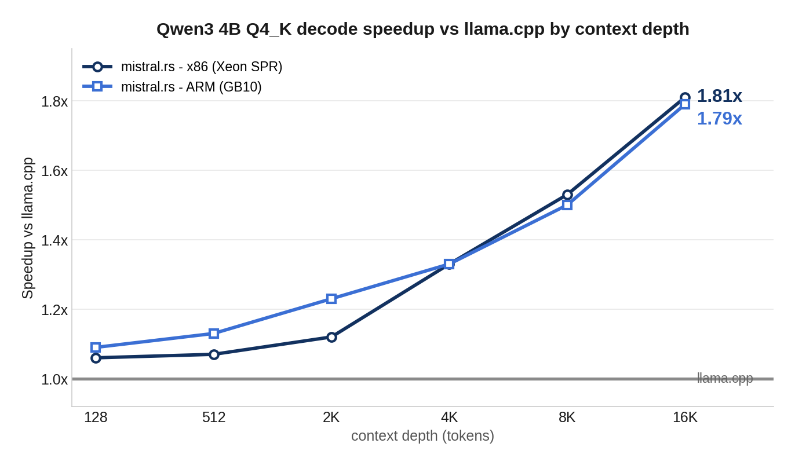
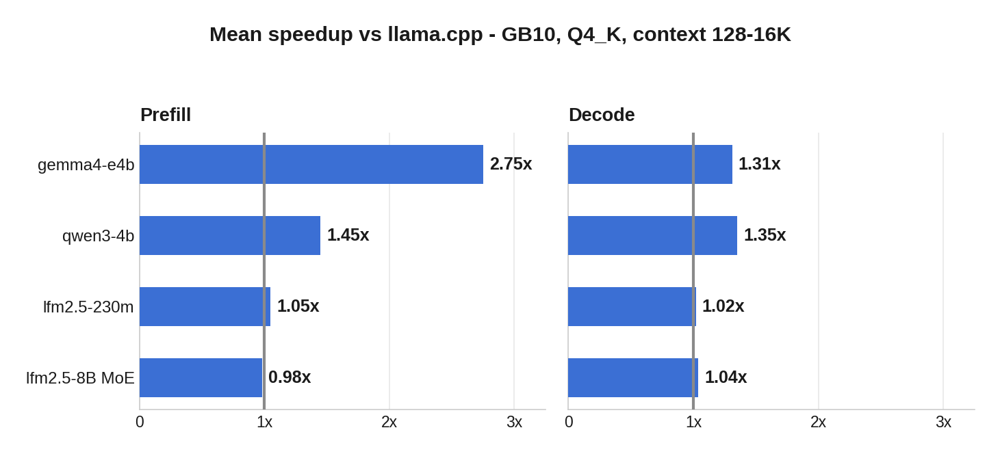

# mistral.rs v0.9.0 CPU Benchmark Report

CPU-only comparison of mistral.rs against llama.cpp on two architectures: GB10 (aarch64, 10x
Cortex-X925) and a c7i.8xlarge Xeon (Sapphire Rapids, AVX512/VNNI/AMX). Values are tokens per
second; speedups are mistral.rs divided by llama.cpp at the same prompt length or decode depth,
with each engine at its best measured configuration.



Decode is at or ahead of llama.cpp at every measured depth on both architectures, and the lead
grows with context: 1.81x (x86) and 1.79x (ARM) at 16K depth. The mechanism, in one line: decode
attention streams the KV cache at memory bandwidth with the output accumulators held in
registers, so per-token cost approaches the hardware's memory floor while llama.cpp's kernel
carries per-position overhead that compounds with depth. A detailed writeup of the kernel design
is forthcoming.

## Headline results

GB10 (aarch64), mean speedup across context lengths 128-8192/16384:

| Model | Quant | Prefill mean | Decode mean |
|---|---|---:|---:|
| gemma4-e4b | Q4_K | 2.75x | 1.31x |
| gemma4-e4b | Q6_K | 2.80x | 1.21x |
| gemma4-e4b | Q8_0 | 2.18x | 1.20x |
| qwen3-4b | Q4_K | 1.45x | 1.35x |
| qwen3-4b | Q6_K | 1.49x | 1.14x |
| qwen3-4b | Q8_0 | 1.15x | 1.13x |
| lfm2.5-230m | Q4_K | 1.05x | 1.02x |
| lfm2.5-230m | Q6_K | 1.05x | 1.06x |
| lfm2.5-230m | Q8_0 | 1.07x | 0.96x |
| lfm2.5-8b-a1b (MoE) | Q4_K | 0.98x | 1.02x |



x86 (Sapphire Rapids), qwen3-4b, per-point ratios:

| q4k | 128 | 512 | 2048 | 8192 | 16384 |
|---|---|---|---|---|---|
| prefill | 0.42x | 0.69x | 0.79x | 0.86x | - |
| decode | 1.06x | 1.07x | 1.12x | 1.53x | **1.81x** |

| q8_0 | 128 | 512 | 2048 | 8192 |
|---|---|---|---|---|
| prefill | 0.79x | 0.66x | 0.72x | 0.81x |
| decode | 0.84x | 0.84x | 0.92x | **1.33x** |

Known gaps, stated plainly: x86 prefill trails llama.cpp's mature AMX path (a feature most of
the x86 fleet lacks; a non-AMX comparison point is planned); MoE prefill at 8192 is 0.87x; q8_0
shallow x86 decode is 0.84x. Causes are understood and fixes are scoped for the next release.

## Method

- Workloads: prompt lengths and decode depths of 128, 512, 2048, 4096, 8192 (and 16384 for
  qwen3-4b Q4_K); 256 generated tokens per decode depth; 1 warmup, 2-3 measured iterations.
- CPU-only builds: mistral.rs without GPU features, run with `--cpu`; llama.cpp with
  `GGML_CUDA=OFF GGML_NATIVE=ON` (Release), pinned commit below.
- Quantization: mistral.rs ISQ `q4k`/`q6k`/`q8_0` (benchmarked from prequantized UQFF,
  numerically identical to `--isq`) versus llama.cpp GGUF `Q4_K_M`/`Q6_K`/`Q8_0`. Q8_0 is the
  same scheme on both engines; ISQ q4k is uniform while GGUF Q4_K_M mixes Q4_K/Q6_K per tensor,
  so the 4-bit tiers are close but not bit-identical.
- Affinity (GB10 big.LITTLE): both engines pinned to the 10 big cores for decode, each at its
  best measured configuration - mistral.rs `CANDLE_CPU_MASK=5-9,15-19`; llama.cpp decode
  `taskset -c 5-9,15-19 -t 10`, prefill at its faster stock `-t 20`. An affinity study
  (`raw/results_affinity.jsonl`) verified pinning mechanism does not matter (engine mask vs OS
  taskset within noise) and that unpinned llama.cpp decode loses >2x to little-core stragglers,
  while unpinned mistral.rs does not (its default thread sizing avoids the little cores).
- llama.cpp fairness: on x86 its flash-attention CPU kernel inverts at depth (fa=1 wins through
  ~2k, fa=0 wins beyond: 8.8 vs 6.3 t/s at d16384), so every reported llama.cpp number is its
  best configuration at that point, mixing fa settings as needed. Raw data includes both.
- The box was otherwise idle; contended runs were discarded and rerun.

## Reproduction

```bash
# full sweep at best-per-engine affinity (GB10)
python3 releases/v0.9.0/scripts/bench_cpu_sweep.py --phase full \
  --mrs-mode mask --lcpp-mode default --lcpp-decode-mode taskset \
  --iters 2 --warmup 1 --gen-len 256 --lengths 128,512,2048,4096,8192
```

Engine command shapes:

```bash
# mistral.rs (ISQ from BF16 safetensors; or --from-uqff a file made by `mistralrs quantize`)
CANDLE_CPU_MASK=5-9,15-19 target/release/mistralrs bench --cpu \
  --prompt-len 128,512,2048,4096,8192 --depth 128,512,2048,4096,8192 \
  --gen-len 256 --iterations 2 --warmup 1 -m Qwen/Qwen3-4B --isq q4k

# llama.cpp prefill / decode
llama-bench -m Qwen3-4B-Q4_K_M.gguf -p 128,...,8192 -n 0 -r 2 -o json -t 20
taskset -c 5-9,15-19 llama-bench -m Qwen3-4B-Q4_K_M.gguf \
  -p 0 -n 256 -d 128,...,8192 -r 2 -o json -t 10
```

- `scripts/bench_cpu_sweep.py` - sweep orchestrator; one JSON row per measurement appended to
  `raw/results_full.jsonl` (later rows supersede earlier ones for the same point), raw engine
  stdout under `raw/raw_full/`.
- `raw/results_x86.jsonl` + `raw/x86_sweep.log` - the x86 sweep (includes both fa configs).
- `scripts/capture_metadata.sh` - host/commit/model metadata (`raw/metadata.txt`).

### Model artifacts

| Artifact | HF repo id | Use |
|---|---|---|
| Qwen3 4B BF16 | Qwen/Qwen3-4B | mistral.rs `--isq` source |
| Gemma 4 E4B BF16 | google/gemma-4-E4B-it | mistral.rs `--isq` source |
| LFM2.5 230M BF16 | LiquidAI/LFM2.5-230M | mistral.rs `--isq` source |
| LFM2.5 8B A1B BF16 | LiquidAI/LFM2.5-8B-A1B | mistral.rs `--isq` source |
| Qwen3 4B GGUF | Qwen/Qwen3-4B-GGUF | llama.cpp Q4_K_M / Q6_K / Q8_0 |
| Gemma 4 E4B GGUF | unsloth/gemma-4-E4B-it-GGUF | llama.cpp Q4_K_M / Q6_K / Q8_0 |
| LFM2.5 230M GGUF | LiquidAI/LFM2.5-230M-GGUF | llama.cpp Q4_K_M / Q6_K / Q8_0 |
| LFM2.5 8B A1B GGUF | LiquidAI/LFM2.5-8B-A1B-GGUF | llama.cpp Q4_K_M |

### Versions and hosts

| Component | Commit or version |
|---|---|
| mistral.rs | v0.9.0 (cpu_parity) |
| candle | aarch64_repack_kernels branch (pinned by mistral.rs Cargo.lock) |
| llama.cpp | 2d973636e292ee6f75fadcf08d29cb33511f509f |
| rustc | 1.96.1 |

Hosts: GB10 (Linux 6.17, 10x Cortex-X925 3.9 GHz + 10x Cortex-A725, 1 NUMA node; full details
in `raw/metadata.txt`); AWS c7i.8xlarge (Xeon Platinum 8488C, 16 physical cores,
avx512f/avx512_vnni/amx_int8).

### Build notes

All benchmarks are source builds of both engines on the same machine (llama.cpp with
GGML_NATIVE=ON, mistral.rs with target-cpu=native), which is what the reproducer scripts do.
Prebuilt installer binaries are portable (runtime-dispatched kernels) and land within ~8% of
source-built throughput on both architectures; build from source to reproduce the tables
exactly. Two aarch64 assets ship: the default assumes ARMv8.2 (Graviton2+, Pi 5, 2018+ ARM)
and a v8.0 compat build covers A72-class boards (Pi 4); the installer picks by cpuinfo probe.

## Appendix: Full Tables

All values are tokens per second; speedup is mistral.rs divided by llama.cpp in the same row.

#### qwen3-4b (GB10)

##### Q4_K Prefill

| Length | mistral.rs ISQ q4_k | llama.cpp GGUF Q4_K_M | mistral.rs speedup |
|---:|---:|---:|---:|
| 128 | 148.6 | 90.0 | 1.652x |
| 512 | 160.1 | 90.6 | 1.768x |
| 2048 | 142.3 | 83.6 | 1.702x |
| 4096 | 100.3 | 76.0 | 1.320x |
| 8192 | 74.9 | 64.2 | 1.167x |
| 16384 | 53.6 | 48.9 | 1.097x |

##### Q4_K Decode

| Depth | mistral.rs ISQ q4_k | llama.cpp GGUF Q4_K_M | mistral.rs speedup |
|---:|---:|---:|---:|
| 128 | 40.3 | 36.9 | 1.092x |
| 512 | 38.9 | 34.4 | 1.132x |
| 2048 | 34.1 | 27.6 | 1.234x |
| 4096 | 29.4 | 22.0 | 1.333x |
| 8192 | 23.3 | 15.6 | 1.498x |
| 16384 | 16.6 | 9.3 | 1.785x |

##### Q6_K Prefill

| Length | mistral.rs ISQ q6_k | llama.cpp GGUF Q6_K | mistral.rs speedup |
|---:|---:|---:|---:|
| 128 | 98.5 | 69.1 | 1.425x |
| 512 | 123.4 | 70.3 | 1.755x |
| 2048 | 105.0 | 66.0 | 1.592x |
| 4096 | 88.7 | 61.4 | 1.445x |
| 8192 | 66.9 | 53.3 | 1.255x |

##### Q6_K Decode

| Depth | mistral.rs ISQ q6_k | llama.cpp GGUF Q6_K | mistral.rs speedup |
|---:|---:|---:|---:|
| 128 | 29.7 | 29.2 | 1.018x |
| 512 | 28.8 | 28.0 | 1.027x |
| 2048 | 26.0 | 23.2 | 1.123x |
| 4096 | 22.9 | 19.1 | 1.200x |
| 8192 | 18.8 | 14.1 | 1.334x |

##### Q8_0 Prefill

| Length | mistral.rs ISQ q8_0 | llama.cpp GGUF Q8_0 | mistral.rs speedup |
|---:|---:|---:|---:|
| 128 | 87.1 | 89.4 | 0.974x |
| 512 | 113.6 | 91.6 | 1.240x |
| 2048 | 107.5 | 83.7 | 1.284x |
| 4096 | 89.8 | 76.5 | 1.173x |
| 8192 | 69.4 | 64.4 | 1.078x |

##### Q8_0 Decode

| Depth | mistral.rs ISQ q8_0 | llama.cpp GGUF Q8_0 | mistral.rs speedup |
|---:|---:|---:|---:|
| 128 | 24.7 | 24.1 | 1.024x |
| 512 | 23.9 | 23.2 | 1.032x |
| 2048 | 22.1 | 19.8 | 1.116x |
| 4096 | 19.9 | 16.6 | 1.199x |
| 8192 | 16.7 | 13.0 | 1.281x |

#### qwen3-4b (x86, Sapphire Rapids)

llama.cpp values are its best fa configuration per point (fa=1 shallow, fa=0 deep).

##### Q4_K Decode

| Depth | mistral.rs ISQ q4_k | llama.cpp GGUF Q4_K_M | mistral.rs speedup |
|---:|---:|---:|---:|
| 128 | 33.9 | 32.0 | 1.06x |
| 512 | 32.4 | 30.3 | 1.07x |
| 2048 | 29.2 | 26.1 | 1.12x |
| 8192 | 21.5 | 14.1 | 1.53x |
| 16384 | 15.9 | 8.8 | 1.81x |

##### Q8_0 Decode

| Depth | mistral.rs ISQ q8_0 | llama.cpp GGUF Q8_0 | mistral.rs speedup |
|---:|---:|---:|---:|
| 128 | 20.6 | 24.5 | 0.84x |
| 512 | 19.9 | 23.7 | 0.84x |
| 2048 | 18.6 | 20.2 | 0.92x |
| 8192 | 16.7 | 12.6 | 1.33x |

Full x86 rows (including prefill and both fa configs): `raw/results_x86.jsonl`.

#### gemma4-e4b (GB10)

##### Q4_K Prefill

| Length | mistral.rs ISQ q4_k | llama.cpp GGUF Q4_K_M | mistral.rs speedup |
|---:|---:|---:|---:|
| 128 | 195.2 | 72.4 | 2.697x |
| 512 | 243.9 | 75.2 | 3.244x |
| 2048 | 211.2 | 72.3 | 2.921x |
| 4096 | 176.7 | 70.5 | 2.505x |
| 8192 | 159.2 | 67.1 | 2.374x |

##### Q4_K Decode

| Depth | mistral.rs ISQ q4_k | llama.cpp GGUF Q4_K_M | mistral.rs speedup |
|---:|---:|---:|---:|
| 128 | 32.9 | 25.1 | 1.311x |
| 512 | 31.8 | 24.3 | 1.311x |
| 2048 | 30.0 | 23.4 | 1.284x |
| 4096 | 29.3 | 22.6 | 1.295x |
| 8192 | 26.1 | 19.7 | 1.325x |

##### Q6_K Prefill

| Length | mistral.rs ISQ q6_k | llama.cpp GGUF Q6_K | mistral.rs speedup |
|---:|---:|---:|---:|
| 128 | 146.7 | 57.2 | 2.563x |
| 512 | 179.6 | 59.7 | 3.009x |
| 2048 | 171.3 | 58.4 | 2.931x |
| 4096 | 147.6 | 57.2 | 2.581x |
| 8192 | 160.1 | 55.2 | 2.898x |

##### Q6_K Decode

| Depth | mistral.rs ISQ q6_k | llama.cpp GGUF Q6_K | mistral.rs speedup |
|---:|---:|---:|---:|
| 128 | 24.2 | 20.4 | 1.185x |
| 512 | 23.7 | 20.1 | 1.176x |
| 2048 | 23.2 | 19.5 | 1.192x |
| 4096 | 22.7 | 18.9 | 1.203x |
| 8192 | 21.4 | 16.7 | 1.280x |

##### Q8_0 Prefill

| Length | mistral.rs ISQ q8_0 | llama.cpp GGUF Q8_0 | mistral.rs speedup |
|---:|---:|---:|---:|
| 128 | 125.4 | 72.2 | 1.737x |
| 512 | 158.6 | 75.6 | 2.099x |
| 2048 | 173.2 | 73.2 | 2.365x |
| 4096 | 156.4 | 71.5 | 2.188x |
| 8192 | 171.0 | 68.5 | 2.497x |

##### Q8_0 Decode

| Depth | mistral.rs ISQ q8_0 | llama.cpp GGUF Q8_0 | mistral.rs speedup |
|---:|---:|---:|---:|
| 128 | 20.5 | 17.5 | 1.172x |
| 512 | 20.2 | 17.2 | 1.176x |
| 2048 | 19.8 | 16.8 | 1.182x |
| 4096 | 19.3 | 16.2 | 1.188x |
| 8192 | 18.5 | 14.6 | 1.266x |

#### lfm2.5-230m (GB10)

##### Q4_K Prefill

| Length | mistral.rs ISQ q4_k | llama.cpp GGUF Q4_K_M | mistral.rs speedup |
|---:|---:|---:|---:|
| 128 | 1328.2 | 1255.5 | 1.058x |
| 512 | 1796.5 | 1624.3 | 1.106x |
| 2048 | 1721.8 | 1484.5 | 1.160x |
| 4096 | 1427.3 | 1359.5 | 1.050x |
| 8192 | 1013.0 | 1181.6 | 0.857x |

##### Q4_K Decode

| Depth | mistral.rs ISQ q4_k | llama.cpp GGUF Q4_K_M | mistral.rs speedup |
|---:|---:|---:|---:|
| 128 | 375.7 | 509.5 | 0.737x |
| 512 | 450.6 | 482.6 | 0.934x |
| 2048 | 444.6 | 404.4 | 1.099x |
| 4096 | 417.6 | 337.6 | 1.237x |
| 8192 | 269.7 | 252.3 | 1.069x |

##### Q6_K Prefill

| Length | mistral.rs ISQ q6_k | llama.cpp GGUF Q6_K | mistral.rs speedup |
|---:|---:|---:|---:|
| 128 | 1209.0 | 1278.7 | 0.945x |
| 512 | 1486.6 | 1363.5 | 1.090x |
| 2048 | 1540.4 | 1287.3 | 1.197x |
| 4096 | 1298.1 | 1183.5 | 1.097x |
| 8192 | 944.8 | 1027.1 | 0.920x |

##### Q6_K Decode

| Depth | mistral.rs ISQ q6_k | llama.cpp GGUF Q6_K | mistral.rs speedup |
|---:|---:|---:|---:|
| 128 | 379.2 | 429.1 | 0.884x |
| 512 | 471.8 | 414.7 | 1.138x |
| 2048 | 418.7 | 359.2 | 1.165x |
| 4096 | 289.3 | 301.8 | 0.959x |
| 8192 | 272.5 | 232.6 | 1.172x |

##### Q8_0 Prefill

| Length | mistral.rs ISQ q8_0 | llama.cpp GGUF Q8_0 | mistral.rs speedup |
|---:|---:|---:|---:|
| 128 | 1377.8 | 1744.8 | 0.790x |
| 512 | 2165.0 | 1749.1 | 1.238x |
| 2048 | 2058.5 | 1622.3 | 1.269x |
| 4096 | 1654.0 | 1462.0 | 1.131x |
| 8192 | 1108.8 | 1230.0 | 0.901x |

##### Q8_0 Decode

| Depth | mistral.rs ISQ q8_0 | llama.cpp GGUF Q8_0 | mistral.rs speedup |
|---:|---:|---:|---:|
| 128 | 287.6 | 368.9 | 0.780x |
| 512 | 324.7 | 353.7 | 0.918x |
| 2048 | 310.0 | 308.6 | 1.004x |
| 4096 | 293.8 | 267.6 | 1.098x |
| 8192 | 210.5 | 211.2 | 0.996x |

#### lfm2.5-8b-a1b (MoE, GB10)

##### Q4_K Prefill

| Length | mistral.rs ISQ q4_k | llama.cpp GGUF Q4_K_M | mistral.rs speedup |
|---:|---:|---:|---:|
| 512 | 234.8 | 229.2 | 1.024x |
| 2048 | 232.9 | 224.0 | 1.040x |
| 8192 | 180.8 | 207.2 | 0.873x |

##### Q4_K Decode

| Depth | mistral.rs ISQ q4_k | llama.cpp GGUF Q4_K_M | mistral.rs speedup |
|---:|---:|---:|---:|
| 128 | 81.2 | 79.7 | 1.019x |
| 512 | 79.7 | 77.1 | 1.034x |
| 2048 | 75.9 | 75.0 | 1.012x |
| 4096 | 70.3 | 69.9 | 1.006x |
| 8192 | 68.4 | 61.8 | 1.107x |

## Appendix: ik_llama.cpp

ik_llama.cpp is the CPU-performance-focused fork by the author of llama.cpp's K-quants, and
the fastest CPU implementation in the llama.cpp family. Same box (c7i.8xlarge), same GGUF,
commit bbc7de4, pinned `taskset -c 0-15 -t 16`, its best fa configuration per point (fa=1
won every point for it). qwen3-4b Q4_K_M, tokens per second:

| | pp512 | pp2048 | pp8192 | d512 | d2048 | d8192 | d16384 |
|---|---:|---:|---:|---:|---:|---:|---:|
| ik_llama.cpp | 391.3 | 348.9 | 235.8 | 32.9 | 28.2 | 18.0 | 12.2 |
| mistral.rs | 274.5 | 239.2 | 140.6 | 32.4 | 29.2 | 21.5 | 15.9 |
| mistral.rs speedup | 0.70x | 0.69x | 0.60x | 0.98x | 1.04x | 1.19x | **1.30x** |

Decode diverges in mistral.rs's favor with depth (+30% at 16K) against a flash-attention
implementation substantially better than mainline's (12.2 vs mainline's best 8.8 t/s at
d16384). ik's prefill GEMM kernels lead the family and nearly match mainline's AMX path
without using AMX. Not benchmarked on aarch64: ik HEAD does not compile there (gcc 13,
Ubuntu 24.04).
