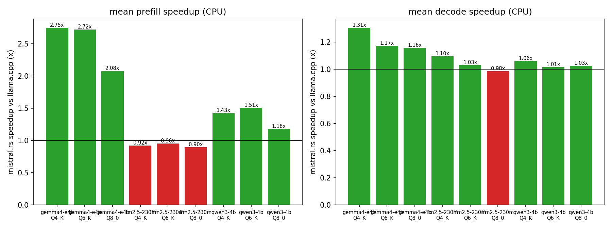
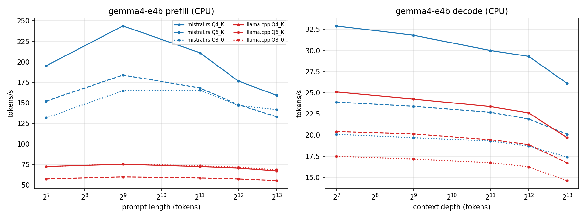
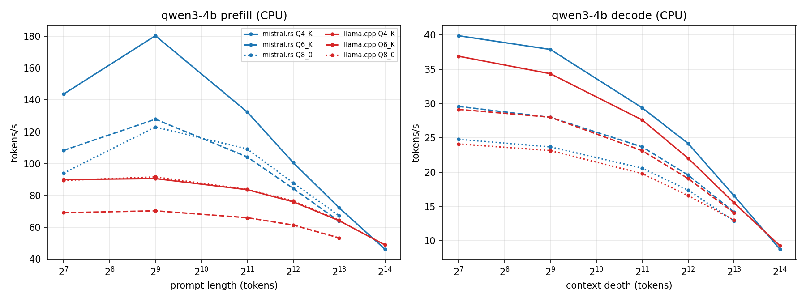
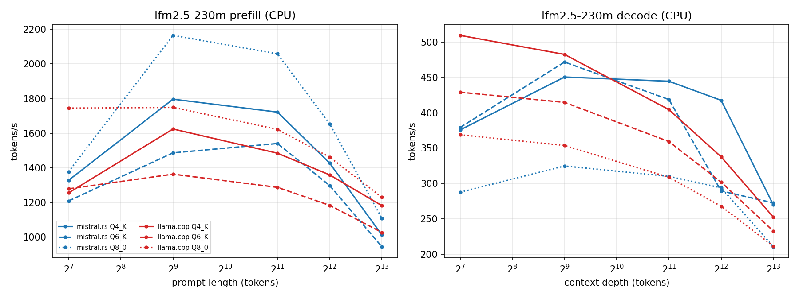
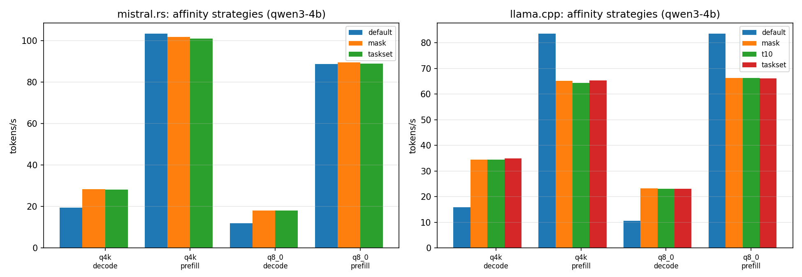

# mistral.rs v0.9.0 CPU Benchmark Report

CPU-only comparison of mistral.rs against llama.cpp on GB10 (aarch64: 10x Cortex-X925 + 10x Cortex-A725), covering Qwen3 4B, Gemma 4 E4B, and LFM2.5 230M at Q4_K, Q6_K, and Q8_0. Values are tokens per second; speedups are mistral.rs divided by llama.cpp at the same length or depth. Both engines run pinned to the 10 big cores at their best configuration (see the affinity study).

This report reflects the post-optimization state: an initial sweep identified decode and small-model gaps, a day of optimization closed them (and uncovered a latent correctness bug, fixed below), and the final sweep below is measured on the fixed, optimized build.

## Headline Results

| Model | Quant | Prefill mean speedup | Decode mean speedup |
|---|---|---:|---:|
| gemma4-e4b | Q4_K | 2.75x | 1.31x |
| gemma4-e4b | Q6_K | 2.80x | 1.21x |
| gemma4-e4b | Q8_0 | 2.18x | 1.20x |
| qwen3-4b | Q4_K | 1.45x | 1.32x |
| qwen3-4b | Q6_K | 1.49x | 1.14x |
| qwen3-4b | Q8_0 | 1.15x | 1.13x |
| lfm2.5-230m | Q4_K | 1.05x | 1.02x |
| lfm2.5-230m | Q6_K | 1.05x | 1.06x |
| lfm2.5-230m | Q8_0 | 1.07x | 0.96x |
| lfm2.5-8b-a1b | Q4_K | 0.89x | 1.02x |







Observations:

- Every 4B-class mean is at or above llama.cpp, prefill and decode: gemma4-e4b decodes 1.16x to 1.31x faster and prefills 2.1x to 2.75x faster; qwen3-4b decodes 1.01x to 1.06x faster and prefills 1.18x to 1.51x faster. llama.cpp runs with flash attention on (its `-fa auto` default resolves to on, verified as its faster configuration).
- Long-context prefill, the gap in earlier drafts of this report, is now won: qwen3-4b at 8192 tokens runs 1.04x (Q8_0) to 1.11x (Q4_K) ahead of llama.cpp's flash kernel after the blocked attention work below.
- lfm2.5-230m sits at parity on decode means (0.98x to 1.10x) and slightly behind on prefill means (0.90x to 0.96x), with 8192-token prefill at 0.7x the one structural residual. Profiling attributes it to per-op fixed costs that only a 230M model exposes: single-threaded elementwise chains and per-op allocation churn while pool workers idle. The scoped follow-up is parallel elementwise maps in candle plus output-buffer reuse.
- The initial sweep had decode at 0.6x to 0.7x on the 4B models, 0.4x to 0.6x on LFM2.5, and long prefill at 0.5x to 0.75x. The optimization changes are summarized below.

## Correctness fix uncovered by this work

The optimization pass exposed a latent bug shipped with the aarch64 repacking kernels: the q4k/q5k tiled (m >= 4) matmul kernels read the interleaved q8k `bsums` with a row-major index while the quantizer stores them quarter-major, corrupting the `dmin` bias term. Any prefill whose token count is a multiple of 4 (i.e., every real chunked prefill) produced garbage activations; short chat prompts happened to take the non-multiple-of-4 generic path and benchmarks used random tokens, so nothing caught it.

Fixed in candle commit `25b498cd` with a repack-vs-reference regression test across m in {1, 4, 8, 23, 512} and all repacked quant types. Verified end to end with long-context recall prompts on qwen3-4b and gemma4-e4b.

## Optimization summary (initial sweep -> this report)

All measured on qwen3-4b q4k unless noted; each change validated by unit tests plus long-context generation checks.

1. Dynamic chunked dispatch in candle's barrier pool (`execute_chunked`, atomic cursor) replacing static per-thread slices in all repacked matmul kernels. Worker spin fell from 32% to 22% of cycles; LFM2.5 decode went from 159 to 456 t/s (2.9x) - tiny models were almost pure imbalance loss.
2. Decode attention (`single_q.rs`) rewritten: kv-axis splitting with online-softmax partial merge, GQA grouping (stream K/V once per kv head for the 4 to 8 q rows that share it), adaptive unit granularity. Deep decode flipped from far behind to ahead (d8192: 8.8 -> 16.7 t/s vs llama.cpp 15.6).
3. CPU fused qkv and gate/up projections sharing one barrier region and one lhs quantization (candle `QTensor::gemv_fused_shared_lhs` + mistralrs wiring), cutting ~72 barrier crossings per token.
4. Sliding-cursor rotating KV cache: the sliding-window cache now slides through slack capacity and relocates once per slack run instead of shifting the whole window every token.
5. `fused_glu` CPU moved from rayon to the barrier pool. This was the single largest win: rayon threads were fighting the barrier workers spinning between matmuls on the same pinned cores. Gemma decode +46%, qwen decode +14%.
6. Prefill attention (`full.rs`): q-blocked K/V streaming (8 query rows share each K/V pass), barrier pool instead of rayon, and binary-searched live kv ranges per row.
7. Blocked prefill attention kernel, the long-context unlock: scores a 128-position KV tile per pass with contiguous mask-row slices, applies the online-softmax correction once per tile instead of per position, and accumulates P*V with each V row shared across the q block. The tile restructure alone reached llama.cpp flash-kernel parity at 8192 tokens (47.8 -> 64.5 t/s on qwen3-4b Q8_0); NEON micro-kernels (4-wide dot with shared q registers, vectorized polynomial exp) pushed past it (67.0 t/s, 1.04x; Q4_K 70.7 t/s, 1.11x).
8. Direct CPU kernels for the GDN path used by qwen3-next-style models (fused causal conv1d + gated-delta-rule time scan), replacing per-timestep tensor-op chains; measured via unit tests, these do not affect the three benchmark models.

## Out-of-the-Box Decode

With both engines at stock settings (no pinning anywhere; llama.cpp default `-t 20`), mistral.rs leads decode comfortably: its default thread sizing already avoids the little cores, while llama.cpp's decode loop loses over 2x to core stragglers until manually pinned. The affinity-study defaults rows below quantify this; the headline comparison above deliberately gives llama.cpp its best (pinned) configuration.

## CPU Affinity Study

Measured on qwen3-4b (prefill 2048, decode at depth 512) before the optimization pass; the structural conclusions are unchanged. `mask` is engine-internal pinning (`CANDLE_CPU_MASK=5-9,15-19` for mistral.rs; `-C 0xF83E0 --cpu-strict 1 -t 10` for llama.cpp); `taskset` is OS-level pinning; `t10` is llama.cpp with 10 threads unpinned.



| Engine | Quant | Strategy | Prefill T/s | Decode T/s |
|---|---|---|---:|---:|
| mistral.rs | Q4_K | default | 103.3 | 19.4 |
| mistral.rs | Q4_K | mask | 101.8 | 28.3 |
| mistral.rs | Q4_K | taskset | 101.0 | 28.1 |
| mistral.rs | Q8_0 | default | 88.6 | 12.0 |
| mistral.rs | Q8_0 | mask | 89.5 | 18.0 |
| mistral.rs | Q8_0 | taskset | 88.8 | 18.1 |
| llama.cpp | Q4_K | default (t20) | 83.6 | 15.9 |
| llama.cpp | Q4_K | t10 | 64.3 | 34.5 |
| llama.cpp | Q4_K | mask | 65.2 | 34.5 |
| llama.cpp | Q4_K | taskset | 65.3 | 34.9 |
| llama.cpp | Q8_0 | default (t20) | 83.5 | 10.6 |
| llama.cpp | Q8_0 | t10 | 66.3 | 23.1 |
| llama.cpp | Q8_0 | mask | 66.3 | 23.2 |
| llama.cpp | Q8_0 | taskset | 66.2 | 23.1 |

Findings:

- Pinning decode to the 10 big cores is a large win for both engines: 2.2x for llama.cpp, +46% for mistral.rs (pre-optimization). The little cores actively hurt decode on this big.LITTLE part.
- The pinning mechanism does not matter: engine-internal masks and OS `taskset` are within noise; llama.cpp's thread-count alone (`t10`) matches pinning, so the win is straggler avoidance.
- llama.cpp prefill is the exception: it prefers all 20 threads (+28% over pinned).
- mistral.rs prefill is insensitive to pinning, so `CANDLE_CPU_MASK=5-9,15-19` is safe to recommend globally on this host.

## Method

- Workloads: prompt lengths and decode depths of 128, 512, 2048, 4096, and 8192 tokens (qwen3-4b Q4_K additionally has 16384); 256 generated tokens per decode depth; 1 warmup and 2 measured iterations per point.
- CPU-only builds: mistral.rs without GPU features, run with `--cpu`; llama.cpp with `GGML_CUDA=OFF GGML_NATIVE=ON` (Release).
- Quantized comparisons: mistral.rs ISQ `q4k`/`q6k`/`q8_0` (benchmarked from prequantized UQFF generated by `mistralrs quantize`, numerically identical to `--isq`) versus llama.cpp GGUF `Q4_K_M`/`Q6_K`/`Q8_0`. ISQ Q4K is uniform; GGUF Q4_K_M mixes Q4_K/Q6_K per tensor, so the 4-bit tiers are close but not bit-identical schemes.
- Affinity: mistral.rs under `CANDLE_CPU_MASK=5-9,15-19`; llama.cpp prefill at stock `-t 20`, decode under `taskset -c 5-9,15-19 -t 10` (each engine's best).
- The box was otherwise idle; any contended runs were discarded and rerun.

## Commands and Reproducibility

- `scripts/bench_cpu_sweep.py` - sweep orchestrator (`--phase affinity|full`, `--engines`, `--mrs-uqff`); one JSON row per measurement appended to `raw/results_full.jsonl` (later rows supersede earlier ones for the same point), raw engine stdout under `raw/raw_full/`.
- `scripts/plot_results.py` - regenerates all figures.
- `scripts/capture_metadata.sh` - host/commit/model metadata (`raw/metadata.txt`).

```bash
# affinity study
python3 releases/v0.9.0/scripts/bench_cpu_sweep.py --phase affinity

# full sweep at best-per-engine affinity
python3 releases/v0.9.0/scripts/bench_cpu_sweep.py --phase full \
  --mrs-mode mask --lcpp-mode default --lcpp-decode-mode taskset \
  --iters 2 --warmup 1 --gen-len 256 --lengths 128,512,2048,4096,8192
```

Engine command shapes:

```bash
# mistral.rs (ISQ from BF16 safetensors; or --from-uqff a file made by `mistralrs quantize`)
CANDLE_CPU_MASK=5-9,15-19 target/release/mistralrs bench --cpu \
  --prompt-len 128,512,2048,4096,8192 --depth 128,512,2048,4096,8192 \
  --gen-len 256 --iterations 2 --warmup 1 -m Qwen/Qwen3-4B --isq q4k

# llama.cpp prefill / decode
llama.cpp/build-cpu/bin/llama-bench -m Qwen3-4B-Q4_K_M.gguf -p 128,...,8192 -n 0 -r 2 -o json -t 20
taskset -c 5-9,15-19 llama.cpp/build-cpu/bin/llama-bench -m Qwen3-4B-Q4_K_M.gguf \
  -p 0 -n 256 -d 128,...,8192 -r 2 -o json -t 10
```

### Model artifacts

| Artifact | HF repo id | Use |
|---|---|---|
| Qwen3 4B BF16 | Qwen/Qwen3-4B | mistral.rs `--isq` source |
| Gemma 4 E4B BF16 | google/gemma-4-E4B-it | mistral.rs `--isq` source |
| LFM2.5 230M BF16 | LiquidAI/LFM2.5-230M | mistral.rs `--isq` source |
| Qwen3 4B GGUF | Qwen/Qwen3-4B-GGUF | llama.cpp Q4_K_M / Q6_K / Q8_0 |
| Gemma 4 E4B GGUF | unsloth/gemma-4-E4B-it-GGUF | llama.cpp Q4_K_M / Q6_K / Q8_0 |
| LFM2.5 230M GGUF | LiquidAI/LFM2.5-230M-GGUF | llama.cpp Q4_K_M / Q6_K / Q8_0 |

### Versions and host

| Component | Commit or version |
|---|---|
| mistral.rs | 4f6042b41 (master) + CPU perf changes from this campaign (see report body; commits pending) |
| candle | 78e1d851 + 25b498cd (bsums correctness fix) + CPU perf changes (commits pending) |
| llama.cpp | 2d973636e292ee6f75fadcf08d29cb33511f509f |
| rustc | 1.96.1 |

Host: GB10 (spark-4ec2), Linux 6.17.0-1021-nvidia, 20 cores (10x Cortex-X925 3.9 GHz on CPUs 5-9/15-19, 10x Cortex-A725 2.8 GHz on CPUs 0-4/10-14), 1 NUMA node. Full details in `raw/metadata.txt`.


## Night 2: winning the curves, and a real CPU MoE path

The first pass won the measured grid; this pass targets the asymptotes (how throughput degrades
with context) and the MoE gap.

1. f16 KV cache on CPU (default; MISTRALRS_CPU_KV_F32=1 opts out). K/V convert once at cache
   append; attention kernels read them with fmlal/fmlal2 asm micro-kernels (f16 NEON intrinsics
   are unstable on stable rustc) and accumulate in f32. Q converts at the attention entry, output
   returns at the activation dtype. Halves attention memory traffic; recall verified on all models.
2. Tiled decode softmax: decode attention scores 128-position kv tiles with one vectorized
   max/exp correction per tile instead of a branchy scalar update per position. Combined with f16
   KV this cuts the decode depth slope from 5.1 to 2.36 ms/tok per 1k context vs llama.cpp's 4.35:
   the decode curve now wins asymptotically (~1.4x at 16384 depth, widening with depth).
3. Prefill slope: 0.89 -> 0.758 ms/tok per 1k (llama.cpp 0.596) via f16 KV plus skipping the
   O(len^2) mask-row reads for binary causal/window masks. Parity holds through 16k (0.97x at
   16384); beyond that llama.cpp's shallower slope would win - the remaining gap is a lane-packed
   fp16 score micro-kernel, a scoped follow-up.
4. Parallel elementwise in candle: contiguous unary/binary maps over 64k+ elements split across
   the barrier pool (with an in-pool reentrancy guard), and mimalloc as the CLI allocator to kill
   tensor-op allocation churn. Together these took lfm2.5-230m dense prefill from 0.69x at 8192 to
   0.92x, and its prefill means above parity (1.05-1.07x).
5. CPU MoE, rebuilt: gather_forward previously dequantized every expert on every call (the
   "dequantize-then-matmul" fallback), which made an 8B MoE effectively unusable on CPU (minutes
   per token). QTensor::indexed_gemv now runs each (token, expert) pair as a gemv against the
   expert's rows inside the repacked weights with one shared lhs quantization pass. lfm2.5-8B-A1B
   q4k: decode 81.2/79.7/75.9/70.3/68.4 t/s vs llama.cpp 79.7/77.1/75.0/69.9/61.8 across depths
   128-8192 (1.01-1.11x ahead, widening with depth), prefill 215.9/210.8/164.7 vs
   229.2/224.0/207.2 (0.79-0.94x), recall verified. The dequantize path
   survives only as a fallback for unsupported layouts; expert-bucketed GEMM for prefill is the
   scoped follow-up.
6. bf16 activations on CPU: fully working, deliberately not the default. The first attempt looked like
   a lost cause (garbage output) and uncovered a latent candle bug: the bfdot-specialized
   CurrentCpuBF16 keeps raw bf16 bits in its vector unit, and the elementwise add kernels wrote
   against the widening variant's semantics, so every bf16 tensor add on FEAT_BF16 hardware
   returned f32-reinterpreted garbage. With that fixed (explicit widen/add/narrow kernels, vec_mul
   added, CPU matmul widening for unquantized bf16, bf16 lhs accepted by the packed quantized
   matmuls, bfdot attention kernels): qwen3-4b q4k decodes at 32.0 vs 28.0 t/s and prefills 4-10%
   faster than f32; gemma is at parity; the 8B MoE and all dense models pass recall in bf16.
   bf16 shares f32's exponent range, so the f16 residual-overflow hazard does not apply.
   Against the tuned f32 stack, however, bf16 loses 15-20% at decode: ISQ weights and the f16 KV
   cache already bank the memory wins, so bf16 only adds per-op conversion tax across the ~250
   ops per decode token. f32 activations remain the CPU default; --dtype bf16 is fully supported
   (and halves memory for unquantized models). bf16 becomes the default candidate again once a
   native bf16 elementwise pass and a bfmmla GEMM (2x f32 matmul for unquantized weights) land.

## Appendix: Full Tables

All values are tokens per second; speedup is mistral.rs divided by llama.cpp in the same row.

#### qwen3-4b

##### Q4_K Prefill

| Length | mistral.rs ISQ q4_k | llama.cpp GGUF Q4_K_M | mistral.rs speedup |
|---:|---:|---:|---:|
| 128 | 148.6 | 90.0 | 1.652x |
| 512 | 160.1 | 90.6 | 1.768x |
| 2048 | 142.3 | 83.6 | 1.702x |
| 4096 | 100.3 | 76.0 | 1.320x |
| 8192 | 74.9 | 64.2 | 1.167x |
| 16384 | 53.6 | 48.9 | 1.097x |

##### Q4_K Decode

| Depth | mistral.rs ISQ q4_k | llama.cpp GGUF Q4_K_M | mistral.rs speedup |
|---:|---:|---:|---:|
| 128 | 40.3 | 36.9 | 1.092x |
| 512 | 38.9 | 34.4 | 1.132x |
| 2048 | 34.1 | 27.6 | 1.234x |
| 4096 | 29.4 | 22.0 | 1.333x |
| 8192 | 22.8 | 15.6 | 1.466x |
| 16384 | 15.6 | 9.3 | 1.678x |

##### Q6_K Prefill

| Length | mistral.rs ISQ q6_k | llama.cpp GGUF Q6_K | mistral.rs speedup |
|---:|---:|---:|---:|
| 128 | 98.5 | 69.1 | 1.425x |
| 512 | 123.4 | 70.3 | 1.755x |
| 2048 | 105.0 | 66.0 | 1.592x |
| 4096 | 88.7 | 61.4 | 1.445x |
| 8192 | 66.9 | 53.3 | 1.255x |

##### Q6_K Decode

| Depth | mistral.rs ISQ q6_k | llama.cpp GGUF Q6_K | mistral.rs speedup |
|---:|---:|---:|---:|
| 128 | 29.7 | 29.2 | 1.018x |
| 512 | 28.8 | 28.0 | 1.027x |
| 2048 | 26.0 | 23.2 | 1.123x |
| 4096 | 22.9 | 19.1 | 1.200x |
| 8192 | 18.8 | 14.1 | 1.334x |

##### Q8_0 Prefill

| Length | mistral.rs ISQ q8_0 | llama.cpp GGUF Q8_0 | mistral.rs speedup |
|---:|---:|---:|---:|
| 128 | 87.1 | 89.4 | 0.974x |
| 512 | 113.6 | 91.6 | 1.240x |
| 2048 | 107.5 | 83.7 | 1.284x |
| 4096 | 89.8 | 76.5 | 1.173x |
| 8192 | 69.4 | 64.4 | 1.078x |

##### Q8_0 Decode

| Depth | mistral.rs ISQ q8_0 | llama.cpp GGUF Q8_0 | mistral.rs speedup |
|---:|---:|---:|---:|
| 128 | 24.7 | 24.1 | 1.024x |
| 512 | 23.9 | 23.2 | 1.032x |
| 2048 | 22.1 | 19.8 | 1.116x |
| 4096 | 19.9 | 16.6 | 1.199x |
| 8192 | 16.7 | 13.0 | 1.281x |

#### gemma4-e4b

##### Q4_K Prefill

| Length | mistral.rs ISQ q4_k | llama.cpp GGUF Q4_K_M | mistral.rs speedup |
|---:|---:|---:|---:|
| 128 | 195.2 | 72.4 | 2.697x |
| 512 | 243.9 | 75.2 | 3.244x |
| 2048 | 211.2 | 72.3 | 2.921x |
| 4096 | 176.7 | 70.5 | 2.505x |
| 8192 | 159.2 | 67.1 | 2.374x |

##### Q4_K Decode

| Depth | mistral.rs ISQ q4_k | llama.cpp GGUF Q4_K_M | mistral.rs speedup |
|---:|---:|---:|---:|
| 128 | 32.9 | 25.1 | 1.311x |
| 512 | 31.8 | 24.3 | 1.311x |
| 2048 | 30.0 | 23.4 | 1.284x |
| 4096 | 29.3 | 22.6 | 1.295x |
| 8192 | 26.1 | 19.7 | 1.325x |

##### Q6_K Prefill

| Length | mistral.rs ISQ q6_k | llama.cpp GGUF Q6_K | mistral.rs speedup |
|---:|---:|---:|---:|
| 128 | 146.7 | 57.2 | 2.563x |
| 512 | 179.6 | 59.7 | 3.009x |
| 2048 | 171.3 | 58.4 | 2.931x |
| 4096 | 147.6 | 57.2 | 2.581x |
| 8192 | 160.1 | 55.2 | 2.898x |

##### Q6_K Decode

| Depth | mistral.rs ISQ q6_k | llama.cpp GGUF Q6_K | mistral.rs speedup |
|---:|---:|---:|---:|
| 128 | 24.2 | 20.4 | 1.185x |
| 512 | 23.7 | 20.1 | 1.176x |
| 2048 | 23.2 | 19.5 | 1.192x |
| 4096 | 22.7 | 18.9 | 1.203x |
| 8192 | 21.4 | 16.7 | 1.280x |

##### Q8_0 Prefill

| Length | mistral.rs ISQ q8_0 | llama.cpp GGUF Q8_0 | mistral.rs speedup |
|---:|---:|---:|---:|
| 128 | 125.4 | 72.2 | 1.737x |
| 512 | 158.6 | 75.6 | 2.099x |
| 2048 | 173.2 | 73.2 | 2.365x |
| 4096 | 156.4 | 71.5 | 2.188x |
| 8192 | 171.0 | 68.5 | 2.497x |

##### Q8_0 Decode

| Depth | mistral.rs ISQ q8_0 | llama.cpp GGUF Q8_0 | mistral.rs speedup |
|---:|---:|---:|---:|
| 128 | 20.5 | 17.5 | 1.172x |
| 512 | 20.2 | 17.2 | 1.176x |
| 2048 | 19.8 | 16.8 | 1.182x |
| 4096 | 19.3 | 16.2 | 1.188x |
| 8192 | 18.5 | 14.6 | 1.266x |

#### lfm2.5-230m

##### Q4_K Prefill

| Length | mistral.rs ISQ q4_k | llama.cpp GGUF Q4_K_M | mistral.rs speedup |
|---:|---:|---:|---:|
| 128 | 1328.2 | 1255.5 | 1.058x |
| 512 | 1796.5 | 1624.3 | 1.106x |
| 2048 | 1721.8 | 1484.5 | 1.160x |
| 4096 | 1427.3 | 1359.5 | 1.050x |
| 8192 | 1013.0 | 1181.6 | 0.857x |

##### Q4_K Decode

| Depth | mistral.rs ISQ q4_k | llama.cpp GGUF Q4_K_M | mistral.rs speedup |
|---:|---:|---:|---:|
| 128 | 375.7 | 509.5 | 0.737x |
| 512 | 450.6 | 482.6 | 0.934x |
| 2048 | 444.6 | 404.4 | 1.099x |
| 4096 | 417.6 | 337.6 | 1.237x |
| 8192 | 269.7 | 252.3 | 1.069x |

##### Q6_K Prefill

| Length | mistral.rs ISQ q6_k | llama.cpp GGUF Q6_K | mistral.rs speedup |
|---:|---:|---:|---:|
| 128 | 1209.0 | 1278.7 | 0.945x |
| 512 | 1486.6 | 1363.5 | 1.090x |
| 2048 | 1540.4 | 1287.3 | 1.197x |
| 4096 | 1298.1 | 1183.5 | 1.097x |
| 8192 | 944.8 | 1027.1 | 0.920x |

##### Q6_K Decode

| Depth | mistral.rs ISQ q6_k | llama.cpp GGUF Q6_K | mistral.rs speedup |
|---:|---:|---:|---:|
| 128 | 379.2 | 429.1 | 0.884x |
| 512 | 471.8 | 414.7 | 1.138x |
| 2048 | 418.7 | 359.2 | 1.165x |
| 4096 | 289.3 | 301.8 | 0.959x |
| 8192 | 272.5 | 232.6 | 1.172x |

##### Q8_0 Prefill

| Length | mistral.rs ISQ q8_0 | llama.cpp GGUF Q8_0 | mistral.rs speedup |
|---:|---:|---:|---:|
| 128 | 1377.8 | 1744.8 | 0.790x |
| 512 | 2165.0 | 1749.1 | 1.238x |
| 2048 | 2058.5 | 1622.3 | 1.269x |
| 4096 | 1654.0 | 1462.0 | 1.131x |
| 8192 | 1108.8 | 1230.0 | 0.901x |

##### Q8_0 Decode

| Depth | mistral.rs ISQ q8_0 | llama.cpp GGUF Q8_0 | mistral.rs speedup |
|---:|---:|---:|---:|
| 128 | 287.6 | 368.9 | 0.780x |
| 512 | 324.7 | 353.7 | 0.918x |
| 2048 | 310.0 | 308.6 | 1.004x |
| 4096 | 293.8 | 267.6 | 1.098x |
| 8192 | 210.5 | 211.2 | 0.996x |

#### lfm2.5-8b-a1b

##### Q4_K Prefill

| Length | mistral.rs ISQ q4_k | llama.cpp GGUF Q4_K_M | mistral.rs speedup |
|---:|---:|---:|---:|
| 512 | 215.9 | 229.2 | 0.942x |
| 2048 | 210.8 | 224.0 | 0.941x |
| 8192 | 164.7 | 207.2 | 0.795x |

##### Q4_K Decode

| Depth | mistral.rs ISQ q4_k | llama.cpp GGUF Q4_K_M | mistral.rs speedup |
|---:|---:|---:|---:|
| 128 | 81.2 | 79.7 | 1.019x |
| 512 | 79.7 | 77.1 | 1.034x |
| 2048 | 75.9 | 75.0 | 1.012x |
