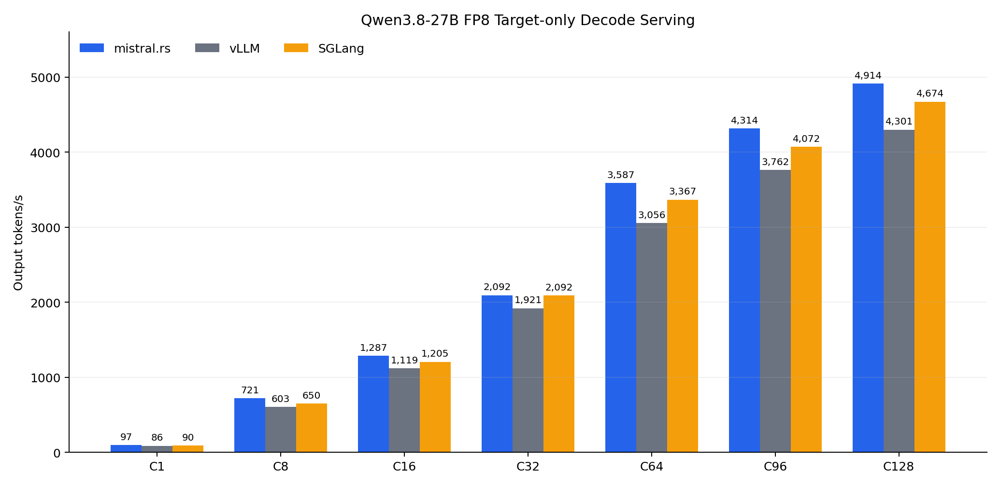
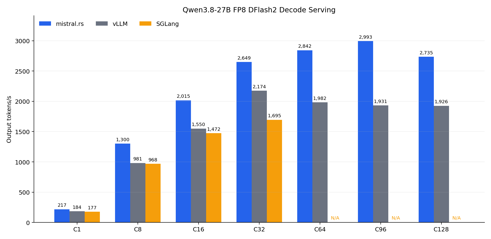

# mistral.rs v0.9.3 FP8 Decode-Serving Benchmark

Decode-heavy serving comparison of mistral.rs, vLLM, and SGLang on one NVIDIA GH200. All
engines served Qwen3.8-27B FP8 with BF16 activations, FP8 E4M3 KV cache, FP32 recurrent state,
the same prompts, and the same production sampling policy. Both target-only and probabilistic
DFlash2 serving were measured from C1 through C128.

On this workload, mistral.rs leads pinned vLLM at every tested concurrency. Target-only output
throughput is 8.9% to 19.5% higher, while DFlash2 output throughput is 17.8% to 55.0% higher.
mistral.rs also leads corrected SGLang target-only throughput at every point and leads SGLang
DFlash2 by 22.6% to 56.3% through C32.

## Target-only results



Each value is the median of three measured repetitions.

| Concurrency | mistral.rs tok/s | vLLM tok/s | vs vLLM | SGLang tok/s | vs SGLang |
|---:|---:|---:|---:|---:|---:|
| C1 | 96.98 | 86.00 | **+12.8%** | 89.58 | **+8.3%** |
| C8 | 721.22 | 603.49 | **+19.5%** | 650.42 | **+10.9%** |
| C16 | 1,287.46 | 1,118.76 | **+15.1%** | 1,204.62 | **+6.9%** |
| C32 | 2,092.50 | 1,921.11 | **+8.9%** | 2,091.55 | **+0.05%** |
| C64 | 3,587.32 | 3,055.66 | **+17.4%** | 3,367.12 | **+6.5%** |
| C96 | 4,314.00 | 3,761.59 | **+14.7%** | 4,072.22 | **+5.9%** |
| C128 | 4,914.05 | 4,300.76 | **+14.3%** | 4,673.67 | **+5.1%** |

mistral.rs median TPOT is 9.7% to 15.5% lower than vLLM throughout the target-only sweep.
Median TTFT is lower through C96 and effectively tied at C128.

SGLang target C64 and above reserves one additional internal sequence-capacity slot. Client
concurrency and the CUDA decode graph remain exactly C. This avoids a reproducible SGLang
bookkeeping cliff that otherwise admits C-1 requests and leaves one request queued for an entire
decode wave; it does not add an active request to the measured workload.

## DFlash2 results



| Concurrency | mistral.rs tok/s | vLLM tok/s | vs vLLM | SGLang tok/s | vs SGLang |
|---:|---:|---:|---:|---:|---:|
| C1 | 216.91 | 184.18 | **+17.8%** | 176.90 | **+22.6%** |
| C8 | 1,299.91 | 980.70 | **+32.5%** | 968.22 | **+34.3%** |
| C16 | 2,015.46 | 1,550.40 | **+30.0%** | 1,472.21 | **+36.9%** |
| C32 | 2,649.16 | 2,173.77 | **+21.9%** | 1,695.08 | **+56.3%** |
| C64 | 2,842.22 | 1,982.44 | **+43.4%** | N/A | N/A |
| C96 | 2,993.44 | 1,931.31 | **+55.0%** | N/A | N/A |
| C128 | 2,734.89 | 1,925.82 | **+42.0%** | N/A | N/A |

SGLang DFlash2 did not start at C64, C96, or C128 with the matched FP32 recurrent-state and
memory configuration.

The high-concurrency DFlash2 numbers are exact end-to-end serving results, not isolated kernel
measurements. They therefore include each engine's KV and recurrent-state capacity, admission
policy, scheduling, and decode execution under the common memory fraction.

## Method

- Hardware: one NVIDIA GH200 480GB with 97,871 MiB HBM exposed, driver 580.105.08, CUDA 13.0,
  and aarch64. The GPU was otherwise idle during measurement.
- Workload: 64 deterministic canonical prompts of 128 to 139 input tokens, repeated as needed to
  produce `max(64, concurrency)` requests. Every request asks for 512 output tokens.
- Client: vLLM 0.27.1 `bench serve` against `/v1/completions`, unlimited request rate, fixed order,
  and exact maximum concurrency C.
- Repetitions: a fresh server and one full-concurrency warmup per cell, followed by three measured
  repetitions. Tables report the median per-run metric.
- Sampling: temperature 1, top-p 0.95, top-k 20, min-p 0, repetition penalty 1, fixed seed
  20260825, and EOS ignored.
- Serving: BF16 activations, checkpoint FP8 weights, FP8 E4M3 KV cache, FP32 recurrent state,
  4,096 maximum model length, 4,096 maximum batched tokens, and prefix caching disabled.
- Memory: 0.66 static memory fraction for target-only and 0.85 for DFlash2.
- DFlash2: probabilistic draft selection with sampling-correct target verification and seven
  proposals after the anchor token.
- Models: target `Qwen/Qwen3.8-27B-FP8` at revision
  `017b9c7af6b5689d5dd426a76e0bc077eb5ca20a`; draft
  `incoai/Qwen3.8-27B-DFlash2` at revision
  `dedf8df68adfb1afeaf7b7480c0a0243108177b4`.
- Model configuration: original target `config.json` SHA256
  `74227dd615bf1ea975aa676bdf355a0379858c12f394b5365cd9dfa5fc2c70bc`.

Output throughput is the number of returned output tokens divided by the common client's complete
measured wall time. It includes admission, prompt processing, TTFT, decode, and scheduler behavior.
The long 512-token completions make decode dominant without removing production-serving effects.

## Versions

| Component | Commit or version |
|---|---|
| mistral.rs | `b6ea3f2aa83bc77db69f1d5963988de72855be47` |
| mistral.rs source SHA256 | `da48c78130710f387e7fe32a571149a157f543b8f9ad25970b3f76d45dd525e6` |
| mistral.rs binary SHA256 | `b97e361e4f79c8ba25c4ca004337cfeb26a71f3a7f531598ad8e79dda93ce0a2` |
| vLLM server | `b389ac29465b33f9e9c534df221ea3c129e9793f` |
| vLLM benchmark client | `0.27.1` |
| SGLang | `1cf2b8c54d81802abc15dcf23a29b9cc687bc01e` (`0.5.19.dev99`) |
| PyTorch | `2.13.0` |

The vLLM server is the official immutable aarch64 wheel for the pinned upstream commit. Its wheel
SHA256 is `a2cc284fbdefba0d8b42d97fece25ac4762407438a4fb8c9f351ed0136a42384`.
The mistral.rs source hash covers the tracked repository tree except `releases/` and identifies
the exact engine source used for the published measurements.

## Reproduction

Create a worktree at the measured mistral.rs revision and build it:

```bash
git fetch origin b6ea3f2aa83bc77db69f1d5963988de72855be47
git worktree add /tmp/mistralrs-v0.9.3-bench \
  b6ea3f2aa83bc77db69f1d5963988de72855be47
cargo build --manifest-path /tmp/mistralrs-v0.9.3-bench/Cargo.toml \
  --release --package mistralrs-cli --features "cuda flash-attn"
```

Create the pinned vLLM client and server environment:

```bash
python3 -m venv /tmp/vllm-bench-venv
/tmp/vllm-bench-venv/bin/python -m pip install --upgrade pip
/tmp/vllm-bench-venv/bin/python -m pip install \
  "vllm[bench]==0.27.1" "matplotlib==3.10.9"
/tmp/vllm-bench-venv/bin/python -m pip install --no-deps \
  --target /tmp/vllm-dflash2-overlay \
  "https://wheels.vllm.ai/b389ac29465b33f9e9c534df221ea3c129e9793f/vllm-0.26.1rc1.dev1048%2Bgb389ac294-cp38-abi3-manylinux_2_28_aarch64.whl"
/tmp/vllm-bench-venv/bin/python -m pip install --no-deps --upgrade \
  --target /tmp/vllm-dflash2-overlay \
  "flashinfer-python==0.6.17" "quack-kernels==0.6.4" "instanttensor==0.1.9" \
  "nvidia-cutlass-dsl==4.6.2" "nvidia-cutlass-dsl-libs-base==4.6.2" \
  "nvidia-cutlass-dsl-libs-core==4.6.2" "nvidia-cutlass-dsl-libs-cu12==4.6.2" \
  "nvidia-cutlass-dsl-libs-cu13==4.6.2" "humming-kernels==0.1.12" "ninja==1.13.0"
```

Create the pinned SGLang environment:

```bash
git clone https://github.com/sgl-project/sglang.git \
  /tmp/sglang-1cf2b8c54d81802abc15dcf23a29b9cc687bc01e
git -C /tmp/sglang-1cf2b8c54d81802abc15dcf23a29b9cc687bc01e checkout \
  1cf2b8c54d81802abc15dcf23a29b9cc687bc01e
python3 -m venv /tmp/sglang-1cf2b8c54d81802abc15dcf23a29b9cc687bc01e-venv
/tmp/sglang-1cf2b8c54d81802abc15dcf23a29b9cc687bc01e-venv/bin/python \
  -m pip install --upgrade pip
/tmp/sglang-1cf2b8c54d81802abc15dcf23a29b9cc687bc01e-venv/bin/python \
  -m pip install -e /tmp/sglang-1cf2b8c54d81802abc15dcf23a29b9cc687bc01e/python
```

Run the complete 42-cell sweep:

```bash
MISTRALRS_REPO=/tmp/mistralrs-v0.9.3-bench \
MISTRALRS_BIN=/tmp/mistralrs-v0.9.3-bench/target/release/mistralrs \
  /tmp/vllm-bench-venv/bin/python \
  releases/v0.9.3/scripts/bench_decode_serving.py
```

The runner pins model revisions, validates the original model configuration and engine source,
restarts each server, executes the full target-only and DFlash2 C1-C128 matrix, stores normalized
results plus source hashes, and generates both bar charts. Use `--resume` after an interruption or
`--dry-run` to print every server command without running the benchmark. Paths can be overridden
with CLI arguments or `MISTRALRS_BIN`, `VLLM_BENCH_BIN`, `VLLM_PYTHON`, `VLLM_OVERLAY`,
`SGLANG_PYTHON`, and `SGLANG_SOURCE`.

Regenerate the committed canonical data and figures from the measured source manifests:

```bash
/tmp/vllm-bench-venv/bin/python releases/v0.9.3/scripts/merge_results.py
```

Regenerate only the figures from `raw/summary.json`:

```bash
/tmp/vllm-bench-venv/bin/python \
  releases/v0.9.3/scripts/bench_decode_serving.py --plot-only
```

## Artifacts

- `raw/summary.json` and `raw/summary.csv`: canonical corrected median results.
- `raw/results.jsonl`: normalized per-repetition measurements used to calculate the medians.
- `raw/run_manifest.json`: portable workload, model, environment, and source-run provenance.
- `raw/source/`: measured source manifests and normalized results, retained verbatim.
- `raw/prompts.jsonl`: exact deterministic prompt workload.
- `scripts/bench_decode_serving.py`: pinned benchmark runner and bar-chart generator.
- `scripts/merge_results.py`: deterministic canonical-cell selection and artifact generator.
