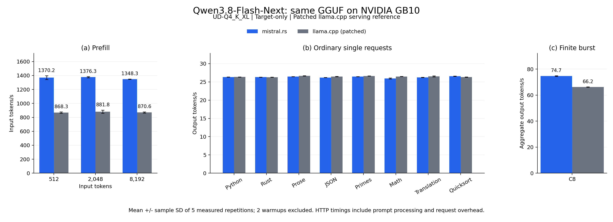
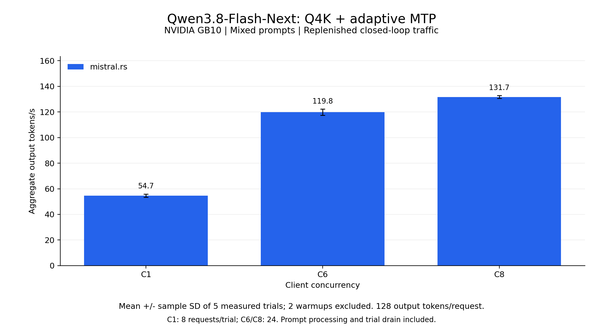
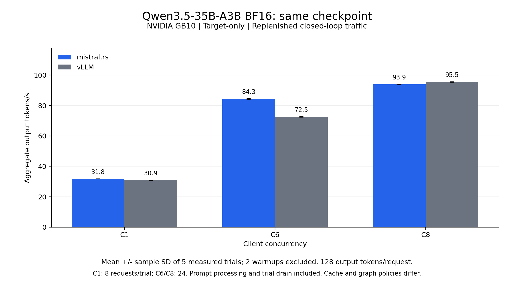

# mistral.rs v0.9.5: Flash-Next serving on NVIDIA GB10

This release package covers Qwen3.8-Flash-Next support, GGUF loading, built-in MTP,
and the September 29-30, 2026 serving measurements on one NVIDIA GB10. It follows
the report/post/data structure of `releases/v0.9.3` while retaining each new
experiment's own protocol.

The final Q4K ISQ + MTP mixed workload measures 54.70/119.85/131.74 aggregate output
tok/s at C1/C6/C8. A separate same-GGUF comparison records 55-58% higher prefill
throughput and 12.7% higher eight-request burst throughput than the patched
llama.cpp reference, with ordinary single-request throughput essentially tied.
The independent Qwen3.5 BF16 control is close to vLLM at C8.

These are measurements of the implementation intended for v0.9.5. The recorded
executables identify themselves as 0.9.4 and predate the final completion-whitespace
fix. Source snapshots and binary hashes identify each measured stage; the release
directory name does not relabel those binaries as a published v0.9.5 build.

## Model and runtime changes

- Qwen3.8-Flash-Next text and vision support, including QSA block-sparse attention,
  hyper-connections, hashed n-gram embeddings, and its sigmoid GDN output gate.
- Direct loading of `qwen4exp` GGUF metadata and `qwen3vl_merger` vision projectors,
  with variant/projector discovery through `--quant` and exact per-layer sizes
  for device mapping.
- Built-in MTP from safetensors/UQFF with paged attention. Flash-Next does not
  support GGUF MTP or external MTP/DFlash drafters.
- cuTile GDN prefill fixes for the block solve and decay rounding on the
  Qwen3.5/3.8 path.
- Available-RAM-minus-1-GiB budgeting and context-capped KV allocation on integrated
  CUDA GPUs, retaining `MISTRALRS_IGPU_MEMORY_FRACTION` as an override.
- Leading whitespace preserved in final and streaming raw completions.

See the [model-family notes](../../docs/src/content/docs/guides/models/model-family-notes.mdx#qwen38-flash-next)
for PLE memory requirements and the [speculative-decoding guide](../../docs/src/content/docs/guides/perf/speculative-decoding.mdx)
for built-in MTP behavior.

## Same-GGUF serving comparison



Both engines use the same UD-Q4_K_XL shards, BF16 KV, a 16,384-token context limit,
and up to eight active sequences. Values are mean +/- sample standard deviation
over five measured trials after two warmups, except the explicitly labeled mean
across eight ordinary prompts.

| Workload | mistral.rs tok/s | Patched llama.cpp tok/s |
| --- | ---: | ---: |
| Prefill 512, input tokens | 1370.2 +/- 26.9 | 868.3 +/- 10.2 |
| Prefill 2048, input tokens | 1376.3 +/- 8.7 | 881.8 +/- 22.5 |
| Prefill 8192, input tokens | 1348.3 +/- 2.4 | 870.6 +/- 9.0 |
| Ordinary decode, mean across eight prompts | 26.31 | 26.46 |
| Eight-request burst, aggregate output tokens | 74.67 +/- 0.28 | 66.24 +/- 0.15 |

Prefill is input tokens divided by client wall time for a one-token completion.
Ordinary decode requests generate 128 tokens. Burst timing covers one synchronized
group of eight requests. All include HTTP, prompt processing, sampling, and drain;
they are not engine-only decode timings or per-token latency measurements.

The llama.cpp server at commit `4b1a27fa0eb875bbca4f6cfe936e3d65adc685c0`
crashed on the initial prefill request without additional allocation padding for
indexed MMQ buffers. The measured serving reference uses the
[scoped padding patch](../../benchmarks/qwen3.8-flash-next/raw/llama-indexed-mmq-padding.patch),
with its existing kernels, fusion, and CUDA graphs. The patched request passes
targeted CUDA memcheck and the complete serving suite. Native unpatched
`llama-bench` results remain [separate](../../benchmarks/qwen3.8-flash-next/README.md#llamacpp-native-benchmark).

This comparison preserves the baseline engine binaries. It is not a new
same-GGUF measurement of the later MTP/graph candidate. The mistral.rs GGUF server
loads the vision projector; the llama.cpp reference is text-only. No cross-engine
memory comparison is made. [Original results and validation](../../benchmarks/qwen3.8-flash-next/README.md)
retain all eight ordinary prompts and synthetic decode cases.

## Final Flash-Next Q4K ISQ + MTP



| Concurrency | Aggregate output tok/s | Output tok/s per active request |
| ---: | ---: | ---: |
| 1 | 54.70 +/- 1.23 | 54.71 +/- 1.23 |
| 6 | 119.85 +/- 2.46 | 20.80 +/- 0.35 |
| 8 | 131.74 +/- 1.07 | 17.32 +/- 0.22 |

These five-trial means follow two warmups. The client cycles through eight fixed
prompts, replenishing completed slots until eight requests at C1 or 24 at C6/C8
finish. Each generates 128 tokens with temperature zero, a fixed seed, ignored
EOS, and prefix caching disabled. All 48 target layers are on CUDA; PLE uses
4-bit storage, attention KV is BF16, and built-in MTP adapts draft depth.
ISQ uses Q4K with sensitive tensors promoted to Q6K, so it is not equivalent to
the UD-Q4_K_XL weight mix above.

Per-active throughput divides output tokens by summed request latency. Mean
active requests can fall below the requested concurrency during drain. The
54.70-to-131.74 change is approximately 2.41x aggregate scaling.

The final depth-four verification graph expansion raises startup captures from
34 to 36 shapes but establishes no additional C6/C8 speedup: prior C8 was
131.94 +/- 0.71 tok/s. Synthetic 16-token-input decode falls from 48.41 to
44.81 +/- 3.60 tok/s in that staged comparison. Adaptive depth and acceptance
also differ, so these are observations across stages, not an isolated causal
measurement of the graph policy.

Separate identical-prompt controls reach 254.90 +/- 17.26 tok/s for Python and
254.35 +/- 14.38 for math at C8. Those use three measured finite-wave trials,
with different draft acceptance and scheduling. They demonstrate workload
dependence and are excluded from the ordinary-serving charts. They do not
measure expert-route overlap or establish a hardware ceiling.

The [optimization report](../../benchmarks/qwen3.8-flash-next/optimization.md#depth-four-graph-followup)
preserves the full serving suite, counter windows, quality-smoke scope, and
[raw candidate archive](../../benchmarks/qwen3.8-flash-next/raw/model_scaling/graph_candidate/README.md).

## Same-checkpoint BF16 MoE control against vLLM



This is Qwen3.5-35B-A3B, a different model, with BF16 weights and no MTP or ISQ.
Both engines use the same checkpoint, tokenizer, ordered requests, 128-output-token
greedy sampling policy, 16,384-token context limit, maximum batch tokens of 4,096,
and eight-sequence limit. Five measured trials follow two warmups.

| Concurrency | mistral.rs output tok/s | vLLM output tok/s | mistral.rs / vLLM |
| ---: | ---: | ---: | ---: |
| 1 | 31.843 +/- 0.008 | 30.921 +/- 0.015 | 1.030x |
| 6 | 84.326 +/- 0.171 | 72.505 +/- 0.124 | 1.163x |
| 8 | 93.854 +/- 0.166 | 95.466 +/- 0.164 | 0.983x |

C8/C1 aggregate scaling is 2.95x for mistral.rs and 3.09x for vLLM. A separate
Nsight capture confirms the native BF16 cuTile fused MoE kernel executes inside
B8 CUDA graphs. vLLM startup selects FlashInfer CUTLASS unquantized MoE. The trace
is excluded from timing, and vLLM's backend label is startup evidence.

Graph buckets and physical KV allocations differ. Native captures exact batches
1-8; vLLM full-decode buckets are 1, 2, 4, and 8. vLLM's C6 bucket policy is a
possible contributor to the C6 difference, not a demonstrated cause. Both use
BF16 attention/convolution state and F32 recurrent GDN state. Their generated
strings can differ; matching requests do not establish matching token routes.

This control does not predict vLLM's Flash-Next or MTP performance. The
[complete BF16 report](../../benchmarks/qwen3.8-flash-next/qwen3.5-bf16-comparison.md)
records all 280 measured requests per engine, precision evidence, cache layouts,
output agreement, and profiler scope.

## Hardware, versions, and scope

- NVIDIA GB10, 128 GB unified system memory, aarch64, driver 580.126.09.
- Native release builds use CUDA 13.2 and `cuda,flash-attn,cutile` features.
- llama.cpp uses CUDA 13.0.88 and the commit/serving patch above.
- vLLM 0.28.0 uses source commit `2cf0a6915ce544dc493a0990f2ea38d81601128a`
  in immutable image `sha256:89154ef00dd15368d2b293c167e5cc7dbb521fcfb2fbb77510e0d4df2b820e8f`.
- The final Flash-Next and native BF16 executable has SHA256
  `92c050e15bbfe15fc99ef11077366a8fb40db5af96223c67e0f9299fce23f2fa`.
  It contains the changes committed as `74a469b6d402bf3795bb3b8eb40920d242185ae9`,
  built before that commit with embedded revision `ec33e3a75`.
- Flash-Next safetensors revision: `de4b8e4d43b917e7706784d8bb445c9af86a3540`.
  All engine/model identities and measured-stage manifests are linked from
  [raw/run_manifest.json](raw/run_manifest.json).

Runs execute sequentially with one model server at a time. Loading, quantization,
startup graph capture, and excluded warmups are outside measured trials. Global
swap counters, clocks, and temperatures are recorded; they do not establish the
absence of GPU paging or isolate its timing cost. Comparisons are not randomized.
Error bars are sample standard deviations, not confidence intervals.

v0.9.3 used a GH200, a dense FP8 model, 512-token outputs, sampled decoding, and
a different harness protocol. Its results are not a direct regression baseline
for these GB10 MoE measurements. No GH200, Jetson, multi-GPU, or additional-engine
performance claim is made here.

## Reproduction and artifacts

Regenerate this package's normalized measurements, summary tables, and figures
from the committed benchmark evidence, using Python 3 and the recorded plotting
dependencies:

```bash
python3 -m pip install -r releases/v0.9.5/scripts/requirements.txt
python3 releases/v0.9.5/scripts/build_release.py
```

The script reads repository-relative source files, validates measured samples,
and records their hashes. It does not start model servers. Detailed raw responses
remain in `benchmarks/qwen3.8-flash-next/raw/` rather than being duplicated here.

The HTTP benchmark harness also requires the Python `tokenizers` package
(`python3 -m pip install tokenizers`). For a new Flash-Next measurement, build
and start the server on the measured
checkpoint revision, adapting the model path to its local snapshot:

```bash
cargo build --release -p mistralrs-cli --features cuda,flash-attn,cutile
target/release/mistralrs serve --no-ui -p 1234 \
  --max-model-len 16384 --max-seqs 8 --prefix-cache-n 0 \
  -m /path/to/flash-next-snapshot --isq q4k --mtp
```

In another terminal, run C1 and C6/C8 with their recorded request counts:

```bash
python3 benchmarks/qwen3.8-flash-next/bench_concurrency.py \
  --label flash-next-isq-mtp --base-url http://127.0.0.1:1234 \
  --tokenizer /path/to/flash-next-snapshot/tokenizer.json \
  --output /tmp/flash-next-c1.json --concurrencies 1 \
  --modes closed-loop --requests 8 --trials 5 --warmup 2 --max-tokens 128
python3 benchmarks/qwen3.8-flash-next/bench_concurrency.py \
  --label flash-next-isq-mtp --base-url http://127.0.0.1:1234 \
  --tokenizer /path/to/flash-next-snapshot/tokenizer.json \
  --output /tmp/flash-next-c6-c8.json --concurrencies 6 8 \
  --modes closed-loop --requests 24 --trials 5 --warmup 2 --max-tokens 128
```

A current-source rerun measures that build, not the frozen historical executable.
Exact per-engine commands, source snapshots, patches, environment records, and
model identities for the published samples remain in the linked source archives.
The [serving harness](../../benchmarks/qwen3.8-flash-next/bench_serving.py) produces
the separate prefill/ordinary/burst suite.

- `post.md`: announcement draft.
- `raw/summary.json` and `raw/summary.csv`: normalized per-cell means and sample SDs.
- `raw/results.jsonl`: per-trial measurements with source references.
- `raw/run_manifest.json`: measured-stage provenance and source hashes.
- `raw/tables.md`: tables generated from the normalized data.
- `scripts/build_release.py`: data validation and figure regeneration.
- [scripts/README.md](scripts/README.md): generator options and rendering environment.
- `figures/`: static charts generated from the same measurements.
